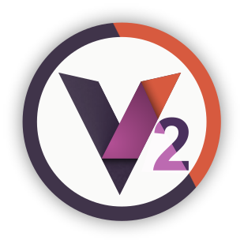
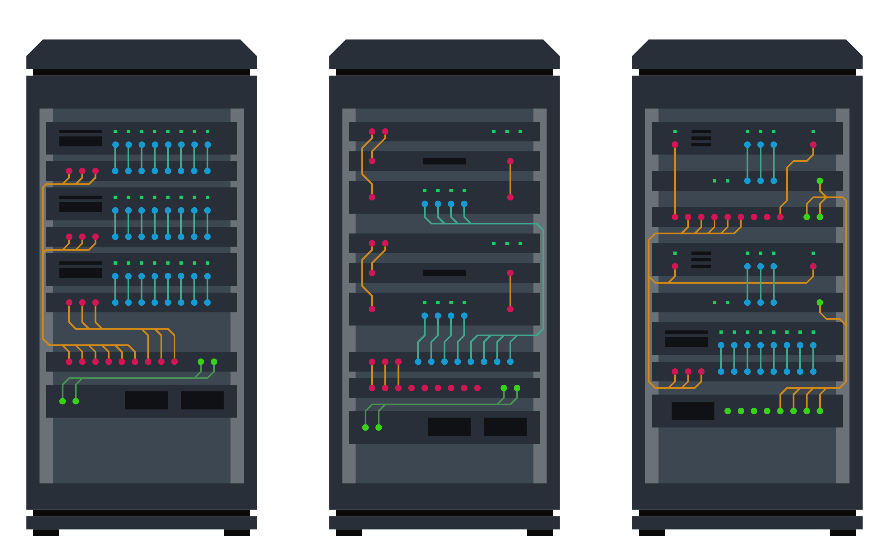

# VRack2 - Фреймворк для автоматизации и управления сервисами

VRack2 представляет собой фреймворк и экосистему, предназначенную для разработки, управления и мониторинга сервисов автоматизации.

## Основные направления применения

- Создание сервисов локальной автоматизации.
- Альтернатива SCADA-системам в подходящих типах проектов.
- Формирование абстракций над физическими устройствами, моделями, данными и другими сервисами.
- Тестирование сервисов и оборудования в режиме непрерывной работы.
- Централизация управления сервисами, упрощение процессов отладки, контроля и сопровождения.
- Инструменты для удалённого взаимодействия с сервисами и получения данных в реальном времени, включая веб-интерфейсы.

## Ключевые характеристики

- Полный контроль над инфраструктурой (self-hosted, отсутствие привязки к поставщику)
- Высокая производительность, близкая к нативному выполнению JavaScript
- Гибкость описания логики

Подходы, реализованные в VRack2, прошли практическую проверку и подтвердили свою эффективность в проектах различного масштаба.

## Архитектура и ключевые концепции

Экосистема VRack2 построена на модульной архитектуре с четким разделением ответственности между компонентами. Основу составляет **VRack2 Core** - фреймворк для создания событийно-ориентированных сервисов на TypeScript/JavaScript, который определяет правила организации кода, структуру файлов и предоставляет базовые компоненты.

Ключевые архитектурные элементы:

- **Структура сервиса** описывается в сервис-файле, где определяются компоненты, их параметры и связи между ними
- **Компоненты (устройства)** - классы, реализующие бизнес-логику, с четко определенными входами (точки приема событий), выходами (точки генерации событий) и параметрами конфигурации
- **Библиотеки** - изолированные наборы зависимостей компонентов

Архитектура обеспечивает автоматическое графическое представление сервисов, автодокументирование и возможность расширения функциональности без изменения исходного кода устройств.

## Начало

- [Введение](./docs/Introduction.md) - общее описание платформы.
- [VRack2 Manager](https://github.com/VRack2/vrack2-manager) - рекомендуется к установке перед началом работы с VRack2.
- [Установка](./docs/Install.md)

## Хочу попробовать!

- [Создание первого сервиса](./docs/FirstService.md)
- [Дополнительные примеры сервисов](https://github.com/VRack2/vrack2-example)

## Разработка 

- [Разработка своих устройств (компонентов)](./docs/Devices.md)
- [Создание сервис-файла](./docs/ServiceFile.md)
- [Особенности программирования в VRack2](./docs/Service.md)
- [Работа с LL интерфейсами: I²C, Serial...](./docs/LLHardware.md)
- [Обработка ошибок](./docs/Errors.md)
- [API VRack2](./docs/Api.md)

## Связанные репозитории

- [VRack2-Service](https://github.com/VRack2/vrack2-service) - запуск сервисов на базе VRack2-Core.
- [VRack2-Core](https://github.com/VRack2/vrack2-core) - фреймворк для событийно-ориентированных сервисов на JavaScript/TypeScript.
- [VGranite](https://github.com/VRack2/VGranite) - сервис для организации туннелей Socket → Serial.
- [VRack2-Remote](https://github.com/VRack2/vrack2-remote) - библиотека для работы с VRack2 API

## Наши наборы устройств

Наборы постоянно дополняются по мере наших собственных потребностей. Но на данный момент их можно использовать как хорошие примеры.

 - [vrack2-system](https://github.com/VRack2/vrack2-system) - Устройства для работы внутренними функциями (перехват событий, адаптеры, простой телеграм). Позволяет быстро настроить уведомления
 - [vrack2-basic](https://github.com/VRack2/vrack2-basic) - Базовый набор, очень часто используется как вспомогательный. Описывает базовые концепции простых устройств
 - [vrack2-net](https://github.com/VRack2/vrack2-net.git) - Устройства для организации простых сервисов TCP/UDP (на данный момент скудно)
 - [vrack2-modbus](https://github.com/VRack2/vrack2-modbus) - Упращенная работа с устройстами которые работают по протоколу Modbus. 
 - [vrack2-other-rtu](https://github.com/VRack2/vrack2-other-rtu) - Набор для разных ModBusRTU устройств

## Статус

Проект находится в стадии активного развития, однако основное API считается стабильным и не планируется к изменению. Документация продолжает дополняться и уточняться.

## Последние изменения 1.1.0

 - Обновление документации
 - Переход на vrack2-core v1.1.2
 - Теперь для работы с воркерами используется класс `UniversalWorkers`
 - Теперь можно изолировать главный процесс от воркера указав `isolated` в метаданных сервис-файла см. [Работа с LL интерфейсами: I²C, Serial...](./docs/LLHardware.md)

## изменения 1.0.1
 - Обновление документации
 - Переход на vrack2-core v1.0.4 - все `require()` заменены на `required()`
 - Теперь сервис сам не перезапускается если он закончился работу одной из следующих ошибок
   - 'CTR_CONF_EXTENDS_PROBLEM'
   - 'CTR_ERROR_INIT_DEVICE'
   - 'CTR_DEVICE_PROCESS_EXCEPTION'
   - 'CTR_DEVICE_PROCESS_PROMISE_EXCEPTION'
   - 'CTR_ERROR_INIT_CONNECTION'
   - 'CTR_IGNORE_SERVICE_AUTORELOAD'