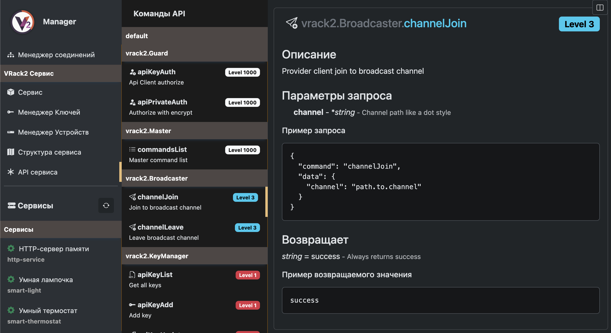
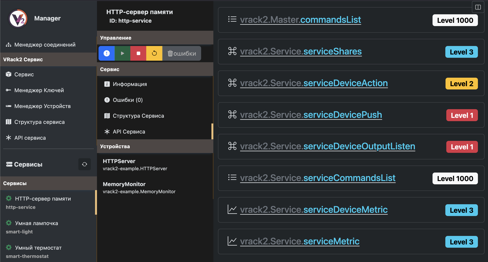
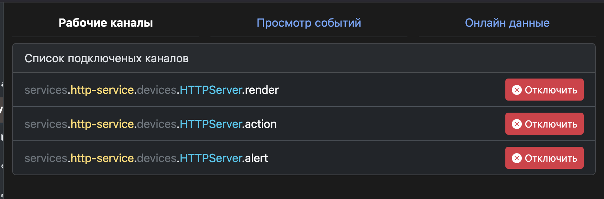

# VRack2 API

Данная документация поможет вам начать взаимодействие с сервером **VRack2** через WebSocket. Полный список команд и их описание доступен в интерфейсе **VRack2 Manager**, так как API динамическое. Здесь приведены только базовые шаги и команды для начала работы.

Рекомендуется использовать [VRack2-Remote](https://github.com/VRack2/vrack2-remote)

Где найти API в **VRack2 Manager**:



Каждый сервис VRack2 запускается так же со своим API, обычно оно не меняется если вы не захотите его расширить. Посмотреть доступные команды для каждого конкретного сервиса можно так:



Нажав в на нужную команду - отобразится документация на нее.

## Рекомендации

- Используйте официальную библиотеку [`vrack2-remote`](https://github.com/VRack2/vrack2-remote) для упрощения работы.

## Подключение

Сервер VRack2 слушает WebSocket-соединения по адресу:  
`ws://<хост>:4044/` (по умолчанию порт 4044).

Все сообщения передаются в формате JSON:

```json
{
  "command": "название_команды",
  "_pkgIndex": 1004,
  "data": { /* параметры */ }
}
```

- `_pkgIndex` — уникальный идентификатор запроса, используется для сопоставления ответа с запросом.

## Аутентификация

### 1. Базовая аутентификация (`apiKeyAuth`)

Уровень доступа: **1000** 

Отправьте ваш API-ключ для идентификации клиента.

**Запрос:**
```json
{
  "command": "apiKeyAuth",
  "data": {
    "key": "ваш_api_ключ"
  }
}
```

**Ответ (пример):**
```json
{
  "cipher": false,
  "verify": "9u49ipjeirhh",
  "level": 3,
  "authorize": false
}
```

- Если поле `verify` присутствует — требуется **дополнительная аутентификация с шифрованием**.
- Поле `level` указывает ваш текущий уровень доступа.
  - 1 - Администратор
  - 2 - Оператор
  - 3 - Диспетчер
  - 1000 - Гость
- `cipher: true` означает, что дальнейший обмен должен быть зашифрован.

### 2. Приватная аутентификация (`apiPrivateAuth`)

Уровень доступа: **1000**

Если сервер вернул `verify`, зашифруйте его с помощью вашего **приватного ключа** и отправьте обратно.

**Запрос:**
```json
{
  "command": "apiPrivateAuth",
  "data": {
    "verify": "зашифрованная_строка"
  }
}
```

**Ответ (пример):**
```json
{
  "cipher": true,
  "level": 3,
  "authorize": true
}
```

> После успешного выполнения `apiPrivateAuth` **весь дальнейший обмен данными должен быть зашифрован**.

## Шифрование (AES-CBC)

Рекомендуется использовать библиотеку **CryptoJS**.

```javascript
// Шифрование
function cipherData(data, privateKey, key) {
  return CryptoJS.AES.encrypt(data, CryptoJS.enc.Utf8.parse(privateKey), {
    iv: CryptoJS.enc.Utf8.parse(key),
    mode: CryptoJS.mode.CBC
  }).toString();
}

// Расшифровка
function decipherData(encryptedData, privateKey, key) {
  const decrypted = CryptoJS.AES.decrypt(encryptedData, CryptoJS.enc.Utf8.parse(privateKey), {
    iv: CryptoJS.enc.Utf8.parse(key),
    mode: CryptoJS.mode.CBC
  });
  return decrypted.toString(CryptoJS.enc.Utf8);
}
```

- `key` — ваш API-ключ (используется как IV)
- `privateKey` — ваш приватный ключ (пароль для шифрования)

## Получение списка команд

### `commandsList`
Уровень доступа: **3**

Возвращает полный список доступных команд с описанием, уровнем доступа и правилами валидации.

**Запрос:**
```json
{
  "command": "commandsList",
  "data": {}
}
```

**Ответ (фрагмент):**
```json
[
  {
    "command": "channelJoin",
    "description": "Provider client join to broadcast channel",
    "level": 3,
    "rules": [],
    "owner": "Broadcaster",
    "short": "Join channel",
    "icon": "share",
    "return": {}
  }
]
```

## Работа с каналами (Pub/Sub)

### Подписка на канал (`channelJoin`)
Уровень доступа: **3**

Подписывает клиента на широковещательный канал по точечному пути.

**Запрос:**
```json
{
  "command": "channelJoin",
  "data": {
    "channel": "path.to.channel"
  }
}
```

**Ответ:**
```json
"success"
```

На данный момент доступны каналы для подключения к событиям и данным всех устройств всех сервисов. Шаблон таких каналов выглядит так

    services.{service-id}.devices.{DeviceID}.{channel}

Пример пути: 

    services.http-service.devices.HTTPServer.render

Вы всегда можете воспользоваться VRack2 Manager для получения пути. Выбрав нужный вам сервис и устройство - подключитесь к нужным вам каналам. Вверху справа будет кнопка консоли, нажав на которую можно будет увидеть пути текущих подключенных каналов:



Есть еще сервисные каналы, с помощью которых можно получать обновления статусов самих сервисов. Это необходимо для реагирование в интерфейсе при отключении/включении сервиса.

Шаблон выглядит так: 

    manager.service.{service-id}.update

Пример пути:

    manager.service.HTTPServer.update

После подписки вам будут приходить сообщения типа:

```json
{ 
   "command":"broadcast",
   "channel":"manager.service.smart-light.update",
   "data":{
        "id":"smart-light",
        "errors":0,
        "run":false,
        "deleted":false,
        "filePath":"devices/vrack2-example/services/smart-light.json",
        "metaPath":"devices/vrack2-example/services/smart-light.meta.json",
        "configPath":"devices/vrack2-example/services/smart-light.conf.json",
        "processPath":"devices/vrack2-example/services/smart-light.process.json",
        "autoReload":false,
        "startedAt":1761064162223},
        "target":"manager.service",
        "providerId":1,
        "clientId":3
    }
```