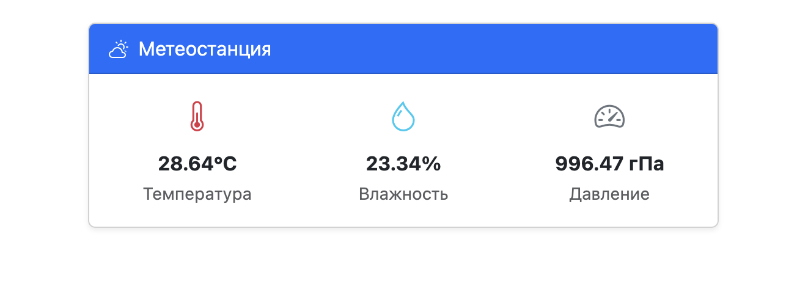

# Сервис "Метеостанция BME280"

Цель данного гайда — показать, как можно работать с I2C на примере устройства для чтения данных с датчика BME280.

Мы создадим устройство, после чего напишем минималистичный интерфейс для отображения данных.

Вы уже установили VRack2 в директорию `/opt/vrack2-service` (по умолчанию) — будем считать это корневой директорией.

## BME280 Sensor

Чтобы создать новое устройство — нам необходимо создать директорию вендора (набор устройств). Все директории вендоров располагаются в директории `devices`. После установки там у вас должна быть директория `vrack2`.

Создайте в директории `devices` папку с именем `bme280-sensor`.

В директории вендора создайте файл `i2cBME280.js` и вставьте готовый код библиотеки:

```js
const i2c = require('i2c-bus');

class i2cBME280 {
    busNumber = 1
    address = 0x76
    last = {
        temperature: 0,
        pressure: 0,
        humidity: 0,
    }

    constructor(busNumber, address) {
        this.busNumber = busNumber
        this.address = address
    }

    async init() {

        this.bus = await i2c.openPromisified(this.busNumber);

        // Чтение калибровки
        const buf1 = Buffer.alloc(24);
        await this.bus.readI2cBlock(this.address, 0x88, 24, buf1);
        const h1 = await this.bus.readByte(this.address, 0xA1);
        const buf2 = Buffer.alloc(7);
        await this.bus.readI2cBlock(this.address, 0xE1, 7, buf2);

        // T: [_, T1, T2, T3]
        this.digT = [
            0,
            buf1.readUInt16LE(0),
            buf1.readInt16LE(2),
            buf1.readInt16LE(4)
        ];

        // P: [_, P1, P2, ..., P9]
        this.digP = [
            0,
            buf1.readUInt16LE(6),
            buf1.readInt16LE(8),
            buf1.readInt16LE(10),
            buf1.readInt16LE(12),
            buf1.readInt16LE(14),
            buf1.readInt16LE(16),
            buf1.readInt16LE(18),
            buf1.readInt16LE(20),
            buf1.readInt16LE(22)
        ];

        // H: [_, H1, H2, H3, H4, H5, H6]
        this.digH = [
            0,
            h1,
            buf2.readInt16LE(0),
            buf2.readUInt8(2),
            ((buf2.readUInt8(3) << 4) | (buf2.readUInt8(4) & 0x0F)),
            ((buf2.readUInt8(5) << 4) | (buf2.readUInt8(4) >> 4)),
            buf2.readInt8(6)
        ];

        // Настройка режима
        await this.bus.writeByte(this.address, 0xF2, 0x01); // hum x1
        await this.bus.writeByte(this.address, 0xF4, 0x27); // temp/press x1, normal
        await this.bus.writeByte(this.address, 0xF5, 0x00); // filter off
    }

    shares = {
        temperature: null,
        pressure: null,
        humidity: null,
        lastUpdate: null,
        status: 'Не инициализирован'
    };

    digT = [];
    digP = [];
    digH = [];

    async readSensor() {

        const buf = Buffer.alloc(8);
        await this.bus.readI2cBlock(this.address, 0xF7, 8, buf);

        const rawPress = (buf[0] << 12) | (buf[1] << 4) | (buf[2] >> 4);
        const rawTemp = (buf[3] << 12) | (buf[4] << 4) | (buf[5] >> 4);
        const rawHum = (buf[6] << 8) | buf[7];

        // === Температура ===
        let var1 = (rawTemp / 16384.0 - this.digT[1] / 1024.0) * this.digT[2];
        let var2 = ((rawTemp / 131072.0 - this.digT[1] / 8192.0) ** 2) * this.digT[3];
        const t_fine = var1 + var2;
        const temperature = (t_fine) / 5120.0;

        // === Давление ===
        var1 = (t_fine / 2.0) - 64000.0;
        var2 = var1 * var1 * this.digP[6] / 32768.0;
        var2 = var2 + var1 * this.digP[5] * 2.0;
        var2 = (var2 / 4.0) + (this.digP[4] * 65536.0);
        var1 = (this.digP[3] * var1 * var1 / 524288.0 + this.digP[2] * var1) / 524288.0;
        var1 = (1.0 + var1 / 32768.0) * this.digP[1];
        let pressure = 0;
        if (var1 !== 0) {
            let p = 1048576.0 - rawPress;
            p = (p - (var2 / 4096.0)) * 6250.0 / var1;
            var1 = this.digP[9] * p * p / 2147483648.0;
            var2 = p * this.digP[8] / 32768.0;
            p = p + (var1 + var2 + this.digP[7]) / 16.0;
            pressure = p / 100.0; // гПа
        }

        // === Влажность ===
        let v_x1 = (t_fine - 76800.0);
        v_x1 = (((((rawHum << 14) - (this.digH[4] << 20) - (this.digH[5] * v_x1)) + 16384.0) >> 15) *
            (((((((v_x1 * this.digH[6]) >> 10) * (((v_x1 * this.digH[3]) >> 11) + 32768.0)) >> 10) + 2097152.0) * this.digH[2] + 8192.0) >> 14));
        v_x1 = v_x1 - (((((v_x1 >> 15) * (v_x1 >> 15)) >> 7) * this.digH[1]) >> 4);
        v_x1 = Math.max(0, Math.min(v_x1, 419430400));
        const humidity = (v_x1 >> 12) / 1024.0;

        // === Сохранение ===
        this.last.temperature = parseFloat(temperature.toFixed(2));
        this.last.pressure = parseFloat(pressure.toFixed(2));
        this.last.humidity = parseFloat(humidity.toFixed(2));
        return this.last
    }
}

module.exports = i2cBME280;
```

### Установка зависимостей

Библиотека `i2cBME280` напрямую использует модуль `i2c-bus`. Нам нужно добавить эту зависимость в директорию вендора.

Создайте в директории вендора (`devices/bme280-sensor`) файл `package.json` со следующим содержимым:

```json
{
  "name": "bme280-sensor",
  "version": "1.0.0",
  "description": "BME280 Sensor Device",
  "license": "ISC",
  "dependencies": {
    "i2c-bus": "^5.2.3"
  }
}
```

Перейдите в директорию вендора и установите зависимости:

```bash
cd devices/bme280-sensor
npm install
```

После выполнения в папке появится директория `node_modules`.

Затем создайте файл `BME280.js` с содержимым:

```js
const { Device, Metric, Rule } = require("vrack2-core");
const i2cBME280 = require("./i2cBME280");

class BME280 extends Device {
  // Тут будет логика
}

module.exports = BME280;
```

Для регистрации в системе — создайте в директории вендора файл `list.json` с содержанием:

```json
["BME280"]
```

В итоге структура файлов должна быть такой:

```
devices/
    bme280-sensor/
        node_modules/
            ... наши зависимости i2c-bus
        list.json
        BME280.js
        i2cBME280.js
        package.json
    vrack2/
...
```

Теперь разберёмся с самим устройством. **Выделим только важные части**, после чего просто **возьмём готовый код устройства**.

### Параметры при запуске

Добавим возможность настроить шину I2C, адрес датчика и интервал опроса:

```js
checkOptions() {
  return {
    busNumber: Rule.number().integer().default(1).min(0).description('Номер шины I2C'),
    address: Rule.number().integer().default(0x76).min(0x76).max(0x77).description('Адрес датчика на шине'),
    interval: Rule.number().integer().default(2000).min(1000).description('Интервал опроса в мс')
  };
}
```

Значения по умолчанию через `.default()` попадут в `this.options` автоматически.

### Метрики для истории

Чтобы VRack2 мог строить графики — опишем метрики:

```js
metrics() {
  return {
    temperature: Metric.inS().retentions('1s:5m, 5s:30m, 1m:1d').description('Температура °C'),
    pressure: Metric.inS().retentions('1s:5m, 5s:30m, 1m:1d').description('Давление гПа'),
    humidity: Metric.inS().retentions('1s:5m, 5s:30m, 1m:1d').description('Влажность %')
  };
}
```

### Состояние через `shares`

Чтобы интерфейс видел актуальные данные — используем реактивное состояние:

```js
shares = {
  initted: false,           // Флаг успешной инициализации
  fail: 0,                  // Счётчик ошибок чтения
  temperature: null,        // Температура в °C
  pressure: null,           // Давление в гПа
  humidity: null,           // Влажность в %
};
```

Как только мы меняем что-то внутри `shares` и вызываем `this.render()`, все подключённые клиенты мгновенно получают обновление.

### Process — запуск устройства

Метод `processPromise()` — точка входа. В нём инициализируем сенсор и запускаем периодический опрос:

```js
async processPromise() {
  this.sensor = new i2cBME280(this.options.busNumber, this.options.address);

  try {
    await this.sensor.init();
    this.shares.initted = true;
    this.render();
    
    // Запускаем опрос с заданным интервалом
    setInterval(this.updateSensor.bind(this), this.options.interval);
  } catch (err) {
    this.error('Error init sensor, retry 5 sec', err);
    setTimeout(this.processPromise.bind(this), 5000);
  }
}
```

---

### Конечный код устройства

Замените содержимое `BME280.js` готовым кодом:

```js
const { Device, Metric, Rule } = require("vrack2-core");
const i2cBME280 = require("./i2cBME280");

class BME280 extends Device {

  // Параметры устройства
  checkOptions() {
    return {
      busNumber: Rule.number().integer().default(1).min(0).description('Номер шины I2C'),
      address: Rule.number().integer().default(0x76).min(0x76).max(0x77).description('Адрес датчика'),
      interval: Rule.number().integer().default(2000).min(1000).description('Интервал опроса в мс')
    };
  }

  // Метрики для сохранения истории
  metrics() {
    return {
      temperature: Metric.inS().retentions('1s:5m, 5s:30m, 1m:1d').description('Температура °C'),
      pressure: Metric.inS().retentions('1s:5m, 5s:30m, 1m:1d').description('Давление гПа'),
      humidity: Metric.inS().retentions('1s:5m, 5s:30m, 1m:1d').description('Влажность %')
    };
  }

  // Реактивное состояние — автоматически отправляется клиентам
  shares = {
    initted: false,
    fail: 0,
    temperature: null,
    pressure: null,
    humidity: null,
  };

  // Точка входа устройства
  async processPromise() {
    this.sensor = new i2cBME280(this.options.busNumber, this.options.address);

    try {
      await this.sensor.init();
      this.shares.initted = true;
      this.render();
      setInterval(this.updateSensor.bind(this), this.options.interval);
    } catch (err) {
      this.error('Error init sensor, retry 5 sec', err);
      setTimeout(this.processPromise.bind(this), 5000);
    }
  }

  // Периодический опрос датчика
  async updateSensor() {
    try {
      const res = await this.sensor.readSensor();
      for (const n in res) {
        this.shares[n] = res[n];
        this.metric(n, res[n]); // Сохраняем в метрику для графиков
      }
      this.render(); // Отправляем обновление клиентам
    } catch (err) {
      this.error('Update sensor error', err);
      this.shares.fail++;
    }
  }
}

module.exports = BME280;
```

### Сервис-файлы

Для запуска устройства добавим его в сервис-файл. Все сервис-файлы лежат в директории `services`.

Создадим файл `weather-station.json` в директории `services`:

```json
{
  "devices": [
    {
      "id": "BME280",
      "type": "bme280-sensor.BME280",
      "options": {
        "busNumber": 1,
        "address": 118,
        "interval": 2000
      }
    }
  ]
}
```

Создадим файл `weather-station.meta.json` в директории `services`:

```json
{
  "name": "Weather Station",
  "group": "sensors",
  "autoStart": true,
  "autoReload": true,
  "isolated": true,
  "description": "Датчик температуры, влажности и давления BME280"
}
```


**ВАЖНО** - **Обратите внимание** - В метаданных мы обязательно указываем флаг `"isolated": true,`. Это говорит VRack2, что наш сервис должен быть запущен в полной изоляции от окружения основного сервиса. 


Для чего это нужно - можно прочитать в документе [Работа с LL интерфейсами: I²C, Serial...](./LLHardware.md)


### Подготовка шины I2C

Перед запуском сервиса нужно узнать номер шины и адрес датчика.

**1. Список доступных шин**  
Команда покажет все активные I2C шины в системе:
```bash
sudo i2cdetect -l
```
Обычно на Raspberry Pi и подобных платах основная шина имеет номер `1`.

**2. Поиск датчика**  
Просканируйте шину (замените `1` на номер из предыдущего шага):
```bash
sudo i2cdetect -y 1
```
В таблице найдите значение `76` или `77`. Это hex-адрес датчика.

```
     0  1  2  3  4  5  6  7  8  9  a  b  c  d  e  f
00:          -- -- -- -- -- -- -- -- -- -- -- -- -- 
...
70: -- -- -- -- -- -- 76 --                        
```

После того как нашли датчик, обновите файл сервиса `weather-station.json`. Укажите найденный номер шины в `busNumber` и адрес в `address`:

```json
{
  "devices": [
    {
      "id": "BME280",
      "type": "bme280-sensor.BME280",
      "options": {
        "busNumber": 1,        ← Номер шины из i2cdetect
        "address": 118,        ← Адрес (0x76 = 118, 0x77 = 119)
        "interval": 2000
      }
    }
  ]
}
```

Перезапустите VRack2 или запустите сервис вручную через VRack2 Manager. 

Вы можете сразу проверить работу датчика перейдя в сервис `Weather Station` и выбрав устройство `BME280`. Во вкладке "События & Данные" подпишитесь на канал `render` и вы практически сразу же должны увидеть данные типа:

```
 root: 5 elements
    initted: true
    fail: 0
    temperature: 28.71
    pressure: 996.42
    humidity: 23.22
```

Если их нет - значит подпишитесь на канал `error`, спустя время секунд вы должны увидеть новое событие, в котором будет ошибка. 

Если же сервис отображается красным - вам в раздел ошибок. Там будут ошибки, которые возникают во время запуска сервиса. 

Вероятнее всего, если что то не работает, то не верно указана шина или адрес устройства.

## Интерфейс: отображаем данные

Нам нужен интерфейс, который **автоматически обновляется**, когда датчик присылает новые данные. Vue 3 делает это «из коробки».

### Шаг 1: Создаём Vue-проект

Давайте установим наш интерфейс в /opt

```bash
cd /opt
npm install -g @vue/cli
vue create weather-ui
```
При создании выберите:
- **Vue 3** (не 2.x)
- Default preset
- npm (если используете по умолчанию npm)


Переходим в папку:
```bash
cd weather-ui
```

### Шаг 2: Ставим библиотеки

```bash
npm install bootstrap bootstrap-icons vrack2-remote
```

### Шаг 3: Подключаем стили

Откройте `src/main.js` и добавьте в начало:

```js
import 'bootstrap/dist/css/bootstrap.min.css'
import 'bootstrap-icons/font/bootstrap-icons.css'
```

### Шаг 4: Пишем интерфейс (`App.vue`)

Замените содержимое `src/App.vue` на этот код:

```vue
<template>
  <div class="container py-4">
    <!-- Сообщения об ошибках / статусе -->
    <div v-if="message" class="alert alert-warning" role="alert">{{ message }}</div>
    
    <!-- Карточка с данными: показываем только после подключения -->
    <div v-if="ready && data" class="card shadow-sm">
      <div class="card-header bg-primary text-white">
        <i class="bi bi-cloud-sun me-2"></i>Метеостанция
      </div>
      <div class="card-body">
        
        <!-- Статус инициализации -->
        <div v-if="!data.initted" class="text-center text-muted">
          <i class="bi bi-hourglass-split me-2"></i>Инициализация датчика...
        </div>

        <!-- Показатели -->
        <div v-else class="row text-center">
          <div class="col-4">
            <i class="bi bi-thermometer-half fs-3 text-danger"></i>
            <div class="fw-bold mt-2">{{ data.temperature }}°C</div>
            <small class="text-muted">Температура</small>
          </div>
          <div class="col-4">
            <i class="bi bi-droplet fs-3 text-info"></i>
            <div class="fw-bold mt-2">{{ data.humidity }}%</div>
            <small class="text-muted">Влажность</small>
          </div>
          <div class="col-4">
            <i class="bi bi-speedometer2 fs-3 text-secondary"></i>
            <div class="fw-bold mt-2">{{ data.pressure }} гПа</div>
            <small class="text-muted">Давление</small>
          </div>
        </div>

        <!-- Счётчик ошибок (если есть) -->
        <div v-if="data.fail > 0" class="text-center mt-2">
          <small class="text-warning">
            <i class="bi bi-exclamation-triangle"></i> Ошибок чтения: {{ data.fail }}
          </small>
        </div>

      </div>
    </div>
  </div>
</template>

<script>
import { ref } from 'vue'
import { VRackRemoteWeb } from "vrack2-remote"

export default {
  name: 'App',
  
  setup() {
    return {
      remote: new VRackRemoteWeb(),
      message: ref(false),
      ready: ref(false),
      data: ref(false),
      settings: {
        host: 'ws://127.0.0.1:4044',  // ← ЗАМЕНИТЕ на IP вашего сервера
        key: 'default',
        service: 'weather-station',
        device: 'BME280'
      }
    }
  },

  mounted() {
    this.remote.host = this.settings.host
    this.remote.setKey(this.settings.key)
    
    this.remote.on('close', () => { 
      this.ready = false
      this.message = 'Соединение разорвано' 
    })
    this.remote.on('error', (e) => { this.message = e.toString() })
    
    this.connect()
  },

  methods: {
    async connect() {
      try {
        this.message = 'Подключение...'
        
        await this.remote.connect()
        await this.remote.apiKeyAuth()
        await this.remote.commandsListUpdate()
        
        // Проверяем наличие сервиса
        const services = await this.remote.command('serviceList', {})
        if (!services[this.settings.service]) throw new Error('Сервис не найден')
        
        // Проверяем наличие устройства
        const structure = await this.remote.command('structureGet', { id: this.settings.service })
        if (!structure[this.settings.device]) throw new Error('Устройство не найдено')
        
        // Подписываемся на обновления shares
        await this.remote.channelJoin(
          ['services', this.settings.service, 'devices', this.settings.device, 'render'].join('.'),
          (data) => { this.data = data.data }
        )
        
        // Запрашиваем текущее состояние
        await this.remote.command('serviceShares', { service: this.settings.service })
        
        this.message = false
        this.ready = true
      } catch (e) {
        this.message = 'Ошибка: ' + e.toString()
      }
    }
  }
}
</script>

<style>
body {
  background: #f8f9fa;
  font-family: -apple-system, BlinkMacSystemFont, 'Segoe UI', sans-serif;
}
.card {
  border: none;
  border-radius: 12px;
}
.fs-3 {
  font-size: 2rem;
}
</style>
```


**ВАЖНО** - Исправьте `settings.host` указав адрес вашего сервера! Строка типа `ws://127.0.0.1:4044` обязательно с указанием ws:// и указанием порта (`4044` по умолчанию)


### Шаг 5: Запускаем

```bash
npm run serve
```

Обычно после сборки и запуска сервера - отображается адрес по которому можно добраться до интерфейса:

```
  App running at:
  - Local:   http://localhost:8080/ 
  - Network: http://192.168.88.68:8080/
```

В таком случае откройте `http://192.168.88.68:8080/` в браузере.

Если интерфейс не подключается — проверьте:
- Порт `4044` открыт на сервере
- В `settings.host` указан правильный IP вашего VRack2
- Сервис `weather-station` запущен

В итоге вы должны увидеть:




## Варианты использования

Интерфейс в данном случае совсем не обязателен. Устройство работает автономно: пишет метрики и обновляет состояние. Веб-страница — лишь один из способов просмотра.

### Доступ с телефона

Это хороший пример, как можно быстро, просто и надежно получать данные прямо на телефоне:

1.  Узнайте IP-адрес сервера VRack2 в локальной сети.
2.  Откройте ссылку на интерфейс в браузере телефона.

Вы увидите актуальные показания без установки дополнительных приложений.

### API и метрики

*   **Метрики:** VRack2 сохраняет историю (графики доступны в VRack2 Manager) или используя API.
*   **Интеграция:** На основе `shares` можно настроить уведомления (например, если температура превысила порог).

Главное здесь — принцип: **железо → устройство → сеть → клиент**. Теперь вы можете прикрутить данные к логгеру или сделать что-то веселое.

Не забывайте изолировать сервисы использующие аппаратные LL интерфейсы.