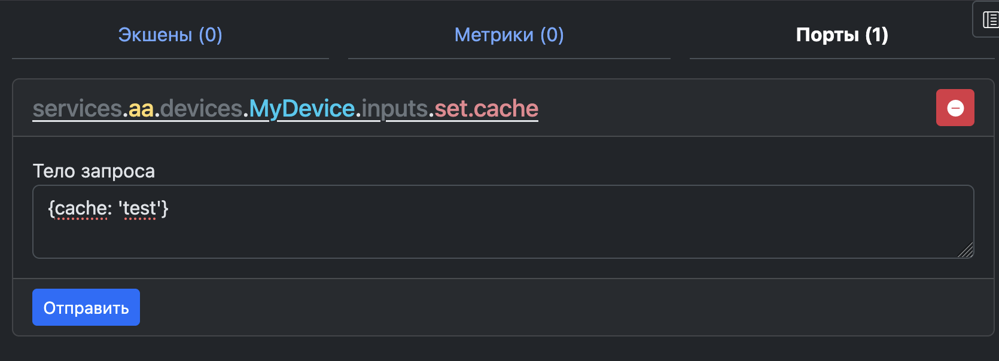

- [Устройства](#устройства)
  - [Добавление устройств](#добавление-устройств)
    - [Структура каталогов](#структура-каталогов)
    - [Регистрация устройств](#регистрация-устройств)
    - [Устройства \& TypeScript](#устройства--typescript)
  - [Класс устройства](#класс-устройства)
  - [Параметры](#параметры)
  - [Порты](#порты)
    - [Правила именования портов](#правила-именования-портов)
    - [Правила именования обработчиков портов](#правила-именования-обработчиков-портов)
    - [Типы портов](#типы-портов)
      - [Стандартный `Port.standart()`](#стандартный-portstandart)
      - [Возвращаемый `Port.return()`](#возвращаемый-portreturn)
    - [Динамические порты](#динамические-порты)
  - [Action (Экшены)](#action-экшены)
  - [Метрики](#метрики)
  - [Обновляемые данные](#обновляемые-данные)
    - [О работе shares данных](#о-работе-shares-данных)
  - [Сервисные сообщения](#сервисные-сообщения)
  - [Сохраняемые данные (storage)](#сохраняемые-данные-storage)
  - [Доступ к контейнеру и другим устройствам](#доступ-к-контейнеру-и-другим-устройствам)
    - [События Container](#события-container)
    - [Обращения к устройствам внутри контейнера](#обращения-к-устройствам-внутри-контейнера)
  - [Жизненный цикл устройства](#жизненный-цикл-устройства)
  - [Самодокументация](#самодокументация)
- [Информация для генерации](#информация-для-генерации)

# Устройства

## Добавление устройств

Устройства организуются по вендорам в директории `devices/`. Каждый вендор — это отдельный модуль (часто отдельный репозиторий).

1. Создайте директорию вендора в `./devices`
   - Имя директории - только строчные латинские буквы (допускается дефис) (напр. `my-devices`)
2. Создайте файл устройства в директории вендора
   - Имя файла: CamelCase (напр. `MyDevice.js`)
3. Создайте файл `list.json` с перечнем устройств

**Важно соблюдать правила именования!**

### Структура каталогов
```
devices/
   {vendor}/          # Директория вендора (напр. "my-devices")
      {Device}.js     # Файл устройства (напр. "MyDevice.js")
      list.json       # Реестр устройств
      package.json    # Опционально: зависимости npm
```

### Регистрация устройств  

Файл `list.json` поддерживает два формата:

1. **Простой массив** (для устройств в корне вендора):  
```json
["Device1", "Device2"]
```

2. **Объект с путями** (для сложной структуры, как в VRack2):  
```json
{
  "Master": "devices/Master",
  "Interval": "devices/Interval",
  "System": "devices/System"
}
```

Пути указываются относительно директории вендора  

### Устройства & TypeScript

В VRack2 устройства написаны на TypeScript. Исходные тексты лежать в директории `devices/vrack2/src` которые  компилируются в JavaScript в директорию `devices/vrack2/devices`.
  
```
devices/
  vrack2/
    devices/       # Результат компиляции
      Master.js    #
      System.js    # 
    src/
      Master.ts    # Исходный текст Master 
      System.ts    # Исходный текст System 
    list.json      # Содержит mapping устройств
    tsconfig.json  # Настройки компиляции TypeScript
```

Можно посмотреть пример настройки в репозитории [устройств VRack2](https://github.com/VRack2-Devices/vrack2)

## Класс устройства

Минимальный пример:

```js
const { Device } = require ("vrack2-core")
class MyDevice extends Device {
  // Конфигурация устройства
}
module.exports = MyDevice;
```


## Параметры

В файле сервиса можно передавать параметры для каждого устройства. Для валидации данных можно переопределить метод `checkOptions` который должен вернуть список правил:

```js
const { Device, Rule } = require ("vrack2-core")

class MyDevice extends Device {
  checkOptions() {
    return {
        option1: Rule.boolean().default(true),
        option2: Rule.number().default(123),
    }
  }

  process(){
    // Получение доступа
    this.options.option1 // true по умолчанию
    this.options.option2 // 123 по умолчанию
  }
}

module.exports = MyDevice;
```

Объект `Rule` описывает требования к данным в простом виде. Его задача - показать, какой основной тип должен придти на входе. Например Строка, объект, массив, число или булевое значение.

Обычно при описании параметров устройства указываются значения по умолчанию - это помогает с запуском при минимальных усилиях.

IDE легко подхатывает автодополнение, где можно найти описание типов дополнительных полей класса `Rule`.

## Порты

Порты обеспечивают взаимодействие между устройствами.

Для добавление портов устройства необходимо переопределить методы `inputs()` и `outputs()`. Каждый метод должен вернуть объект со списком портов:


```js
const { Device, Port, Rule } = require ("vrack2-core")

class MyDevice extends Device {

    /** Определение списка входов */
    inputs(){
        return {
            'console.log': Port.standart().description('Порт для вывода данных в консоль'),
            'console.error': Port.standart().description('Порт для вывода ошибки в консоль')
        }
    }

    /** Определение списка выходов */
    outputs(){
        return {
            gate: Port.standart().description('Сигнальный выход')
        }
    }

    /** Для каждого входящего порта необходимо назначить обработчик */

    /**
     * Для входа console.log
    */
    inputConsoleLog(data){
      console.log(data)
      if (this.ports.output['gate'].connected){
        // Отправляем сигнал со значением 1 на выход gate
        // Каждый раз когда нам приходит сигнал на вход log
        this.ports.output['gate'].push(1)
      }
    }

    /**
     * Для входа console.error
    */
    inputConsoleError(data){
      console.error(data)
      if (this.ports.output['gate'].connected) 
        this.ports.output['gate'].push(1)
    }
}

module.exports = MyDevice;
```

Результат: 


### Правила именования портов

Входы и выходы указываются одним словом, латиницей, маленькими буквами без дополнительных символов. 
Название может содержать цифры, но только не первым символом. Группы имеют **только 1 уровень** вложенности.

Примеры именований:

 - Правильно - `start`, `stop`, `reset`, `input1`, `control.start`, `control1.reset`, `timers.gate1`
 - **НЕ** Правильно - `1input`, `INPUT`, `input one`,`input-one`, `trigger.control.start`, `a.b.c.d`

### Правила именования обработчиков портов

Именуются с префикса `input` после чего добавляется название порта в CamelCase. 

Примеры именований обработчиков входов:

- `gate` - `inputGate`, `control.gate` - `inputControlGate`, `basic.start1` - `inputBasicStart1`

### Типы портов

В VRack2 есть 2 типа портов - стандартные и возвращаемые. Порты **разного типа несовместимы** между собой. 

#### Стандартный `Port.standart()`

 - Один выход → несколько входов
 - Не поддерживают возврат значений

Типичное применение: 
  - передача данных, прим. измеренного значения
  - логгирование
  - передача обновления, статусных данных
  - триггер событий

#### Возвращаемый `Port.return()`

 - Один выход → один вход
 - Поддерживают возврат значений
  
Типичное применение:
 -  Локальные сервисы
 -  API-подобное взаимодействия
 -  Работа с базами данных и получение данных
 
В VRack2 возвращаемые порты используются для обработки запросов от клиента через WebSocket сервер. С помощью таких портов можно реализовывать многоуровневые абстракции над запросами.

На схеме ниже показана часть сервиса VRack2, красным выделена связь с портами типа `return()`:


 - **WSProvider** - принимает запрос пользователя и ожидает овета от **ProvidersClients**. 
 - **ProvidersClients** - оборачивает запрос с дополнительными данные и отправляет их в **Guard** ожидая ответ
 - **Guard** - Проверяет/дешифрует данные добавляя данные о авторизации, передает запрос дальше в **Master**
 - **Master** - Выполняет зарегистрированную команду API и возвращает результат по цепочке вызовов к **WSProvider**

Внутри **WSProvider** вызов `command` выглядит так:

```ts
const res: IProviderMessage = await this.ports.output.command.push(req)
```

Его задача - передать запрос и вернуть ответ клиенту.

Таким образом можно легко расширять фнукционал существующих схем основанных на возвращаемых портах. Строить большие и сложные API сервисы.

### Динамические порты

Можно добавлять порты в устройство на этапе создания. Количество портов может зависить например от переданных параметров.

Для этого при указании порта необходимо передать, количество портов и маску:

```js
  checkOptions() {
    return {
      logs: Rule.number().default(8).min(0).max(32),
    }
  }

  inputs(){
      return {
          // dynamic(number) определяет количество динамических портов
          // %d будет заменен на порядковый номер порта - 1,2,3,4,5,6,7,8
          'console.log%d': Port.standart().dynamic(this.options.logs).description('Порт для вывода данных в консоль'),
      }
  }

  /**
   * preProcess Выполняется сразу после создания класса устройства и назначение ему параметров
  */
  preProcess(){
    // Порты добавяться автоматически а вот обработчики для каждого порта - нет
    // Нам нужно добавить их вручную для каждого порта
    // Это нужно делать на этапе preProcess.
    for (let i = 1; i <= this.options.logs; i++){
      this.addInputHandler('console.log' + i, data=>this.inputConsoleLog(data,i))
    }
  }

  /**
   * Входов может быть несколько, но выполнять они могут практически тоже самое
   * Мы определили одну точку входа но будем отделять их по параметру port
  */
  inputConsoleLog(data, port){
    console.log('PORT - ' + port, data)
  }
```
Результат:


Иногда есть необходимость создавать динамически целые группые портов, например:

```js
  inputs(){
    return {
        /**
         * В таком случае будет созданые группы портов схеме будут объеденяться на схеме
        */
        'group%d.log': Port.standart().dynamic(this.options.groups),
        'group%d.error': Port.standart().dynamic(this.options.groups),
        'group%d.notify': Port.standart().dynamic(this.options.groups),
    }
  }
```

Результат:


Так же допускается генерация объекта списка портов внутри `inputs()` и `outputs()` вручную.

----------------------------------------------------

**Незабывайте добавлять обработчики для каждого входа.** В противном случае сервис просто не запуститься.

----------------------------------------------------

## Action (Экшены)

Для взаимодействия с устройствами через API можно использовать экшены устройства. Для добавление экшена необходимо переопределить метод `actions` который должен вернуть объект со списком экшенов.

Пример добавления:

```js
const { Device, Port, Rule, Action } = require ("vrack2-core")

class MyDevice extends Device {
  actions (){
    return {
      // Пока есть только 1 тип экшена - глобальный (global())
      'test.action': Action.global()
         // requirements - правила для валидации входящих данных
        .requirements({
          num: Rule.number().integer().default(1)
        })
    }
  }
  /**
   * Экшены всегда асинхронные и обязаны возвращать Promise
   * 
   * @param data передаваемые данные в экшен всегда объект и не поддерживает примитивы
  */
  async actionTestAction(data){
    // Выполняем нужный нам код и возвращаем результат
    return data
  }
}

module.exports = MyDevice;
```

Запустим наше устройство и попробуем выполнить его экшен в VRack2 Manager:


Экшен обязан возвращать данные, которые могут быть сериализированны через `JSON.stringify()`

## Метрики

Для регистрации метрики необходимо переопределяя метод `metrics()`.

Под капотом используется [VRackDB](https://github.com/ponikrf/VRackDB). 

Пример регистрации метрики: 

```js
  metrics() {
    return {
      'test.metric': Metric
        // Считаем время в секундах
        .inS()
        // Сколько по времени храним и с какой точностью 
        // В данном случае точность 1 секунда и данные харяться 6 часов
        .retentions('1s:6h')  
        .additional('Любая специфичная для метрики информация')
        .description('Описание метрики'),
    }
  }
```
Название метрики должно быть уникальным для данного устройства. Строка может содердать следующие символы [a-zA-Z0-9._*]. Не делайте длинных названий. Пример `boilers.{bid}.{metricid}`,`houses.{houseid}.{metricid}`, `memory.{memoryParam}`, `downloads.{fileid}`.


VRackDB записывает данные по кругу используя RoundRobin алгоритм. В `retentions` можно указать сразу несколько слоев разной точности и периода - прим.  `1s:6h, 15s:1d`. Если не использовать `retentions` по умолчанию будет использована схема `5s:10m, 1m:2h, 15m:1d, 1h:1w, 6h:1mon, 1d:1y`. 

Запись метрики:

```js
  process(){
    setInterval(() => {
      this.metric('test.metric', Math.sin(Date.now()/100000))
    }, 1000);        
  }
```

В VRack2 Manager можно посмотреть результат:


Рекомендуется ознакомится с [официальным гайдом](https://github.com/ponikrf/VRackDB/wiki/RU%E2%80%90DOC%E2%80%90V3.0) базы VRackDB


## Обновляемые данные

Каждое устройство VRack2 содержит специальный объект `shares`, предназначенный для передачи динамически изменяющихся данных в реальном времени. Это мощный инструмент для создания реактивных интерфейсов, которые мгновенно отражают изменения состояния системы для всех подключенных клиентов.


Типичные применения:

- **Статусные флаги** (работает/остановлено, активно/неактивно)
- **Счетчики** (сообщений, операций, ошибок)
- **Текстовые уведомления** (последние события, статусы)
- **Показатели состояния** (прогресс выполнения, уровни сигналов)
- **Структурированные данные** (списки элементов, конфигурации)

Простой пример счетчика сообщений:

```js
const { Device, Port, Rule } = require ("vrack2-core")

class MyDevice extends Device {

    /** Определение списка входов */
    inputs(){
        return {
            'console.log': Port.standart().description('Порт для вывода данных в консоль'),
        }
    }

    /**
     * Этот объект есть у всех устройств, можно его модифицировать как угодно
     * Добавим в него счетчик полученных сообщений
    */
    shares = {
      count: 0
    }

    process(){
      // Заранее отправим данные по умолчанию заполненные в shares
      this.render() 
    }

    inputConsoleLog(data){
      console.log(data)
      this.shares.count++ // Обновляем счетчик
      this.render() // Ставим в очередь обновление shares
    }
}

module.exports = MyDevice;
```

Теперь, если воспользоваться VRack2 Manager можно отправить в порт данные для печати и понаблюдать как в режиме онлайн будут меняться данные shares:


Каждый раз когда мы будем отправлять даннные в порт, в консоли мы будем видеть

```js
{ objectForSend: 'objectValue' }
```

а счетчик count будет автоматически увеличиваться.

### О работе shares данных

 1. **Полная инициализация** - Всегда старайтесь полностью описывать структуру `shares` при создании устройства
 2. **Оптимизация обновлений** - `this.render()` ставит в очередь обновление, а не отправляет его мгновенно (интервал обновления ~200мс)
 3. **Ограничения данных** - Только JSON-сериализуемые данные, рекомендуемый размер < 10KB
 4.  **Иммутабельность** - Не пересоздавайте объект `shares`, только модифицируйте его свойства


## Сервисные сообщения

Устройства могут отправлять сервисные сообщения. Обычно сервисные сообщения нужны для того, что бы отслеживать, как работает сервис.

Эти сообщения передаются в VRack2 и далее используя широковещательные каналы отправляются подписанным клиентам по аналогии с `shares` данными.

Если на каналы сообщений никто не подписан - их никто не получит. Самый простой способ - использовать VRack2 Manager.

Вы можете сами решать что с ними делать в рамках каждого сервиса.

Формализованные типы сообщений:

- this.**terminal**(_message_, _trace_ ) - Debug информация
- this.**notify**(_message_, _trace_ ) - Небольшие оповещения о значимых действиях
- this.**error**(_message_, _trace_ ) - Некритичные для работы дашборда ошибки
- this.**alert**(_message_, _trace_ ) - Оповещения, требующие реакции
- this.**event**(_message_, _trace_ ) - Оповещения о событиях


Простой пример отправки в терминал:

```js
const { Device, Port, Rule } = require ("vrack2-core")

class MyDevice extends Device {

    /** Определение списка входов */
    inputs(){
        return {
            'console.log': Port.standart().description('Порт для вывода данных в консоль'),
        }
    }

    inputConsoleLog(data){
      // Вместо отправки в консоль, будем отправлять данные в терминал
      this.terminal('console.log', data)
    }
}

module.exports = MyDevice;
```

Теперь воспользуемся VRack2 Manager, подпишемся на канал `terminal` устройства и отправим в его порт данные:


Такие сообщения можно перехватывать внутри самого сервиса, что бы сохранять в базу или файл, отправлять в месенджер или оповещять другие сервисы о событиях.


## Сохраняемые данные (storage)

Некоторые устроства должны запоминать некоторое состояние и восстанавливать его после перезагрузки сервиса. Для таких случаев у каждого устройства есть объект `storage`. 

Он по аналогии с `shares` хранит только JSON сериализируемые данные, а что бы сохранить обновленные данные нужно вызвать `this.save()`.

Объект `storage` автоматически восстанавливается после запуска устройства до вызова `process()`.

Простой пример использования:

```js
const { Device, Port, Rule } = require ("vrack2-core")

class MyDevice extends Device {

    /** Определение списка входов */
    inputs(){
        return {
            'set.cache': Port.standart(),
        }
    }

    storage = {
      chache: {}
    }
    
    inputSetCache(data){
      this.storage.chache = data
      this.save()
    }
}

module.exports = MyDevice;
```

Отправим данные в порт: 



в каталоге хранилища будет создан файл `/storage/aa/MyDevice.json` с содержимым:

```json
{"chache":{"cache":"test"}}
```

а при перезапуске устройства эти данные автоматически попадут в storage устройства.

**Не рекомендуется действительно часто сохранять данные - может быть вредно для SSD**


## Доступ к контейнеру и другим устройствам

Иногда есть необходимость получать доступ к контейнеру устройства (классу Container) который занимается хранением, инициализацией устройств и созданием связей между устройствами на основе файла сервиса.

Это может быть полезно например для перехвата сервисных сообщений, или получения списка работающих устройств и доступа к ним. 

Внутри каждого устройства к контейнеру можно обратиться так:

```js
this.Container
```

### События Container
 
Контейнер это `EventEmitter` класс. События указаны в порядке их запуска:

 1. **configure** - Запускается первым, перед заполнением файла конфигурации
 2. **beforeInit** - Перед началом инициализации
 3. **init** - Начало инициализации устройств
 4. **initDevice(device)** - Будет выполнятся для каждого инициализируемого устройства
 5. **afterInit** - После окончания инициализации устройств
 6. **beforeConnections** - Перед началом инциализации соединений
 7. **connections** - Начало инициализации соединений
 8. **connection(conn)** - Будет выполнено для каждого соединения
 9. **afterConnections** - После окончания инциализаций соеднинений
 10. **beforeProcess** - Перед выполнением `process` для каждого устройства
 11. **process(DeviceID)** - Будет выполнено для каждого устройства перед запуском `process`
 12. **afterProcess** - После окончания всех запусков `process`
 13. **beforeProcessPromise** - Перед выполнением `processPromise` каждого устройства
 14. **processPromise(DeviceID)** -  Будет выполнено для каждого устройства перед запуском `processPromise`
 15. **afterProcessPromise** - После окончания всех запусков `processPromise`
 16. **beforeLoaded** - Перед окончанием загрузки контейнера
 17. **loaded** - После окончания загрузки контейнера

События перечисленные выше редко могут быть полезными для устройств внутри контейнера. Чаще всего они используются в Bootstrap классах, которые расширяют возможности устройств но находяться выше контейнера.

Могут быть полезны события, которые генерируют сами устройства.

События сервисных сообщений:

 - **device.terminal** - Все сообщения отправленные через `this.terminal` и тп
 - **device.notify** 
 - **device.event**
 - **device.alert**
 - **device.error**
  
Другие события:

 - **device.render** - При вызове  `this.render()`
 - **device.save** - При вызове `this.save()`
 - **device.metric** - При вызове `this.metric()`
 - **device.terminate** - При вызове аварийного завершения `this.terminate()`

Пример использования событий контейнера внутри устроиства:

```js
  // Подписываемся только в методах process/preProcess/processPromise
  process(){
    this.Container.on('device.alert', (alertData)=>{
      this.sendToTelegram(this.alertToText(alertData))
    })
  }
```


### Обращения к устройствам внутри контейнера

Очень редко бывает нужно обращаться к другим устройствам внутри контейнера напрямую. Обычно бывает необходимость обратиться к определенному типу устройств внутри одного вендора. Например так:

```js
  inputReconfigure(conf){
    for (const deviceId in this.Container.devices){
      const Device = this.Container.devices[deviceId]
      // Фильтрация по типу
      if (Device.type === 'you-vendor.DeviceClass'){
        Device.reconfigure(conf)
      }
    }
  }
  this.Container.devices[deviceID]
```

Пример выше можно заменить на порт reconfigure и отправлять в каждый порт подобного устройства данные. Но бывают редкие случаи когда это бывает актуально.

## Жизненный цикл устройства

Этапы жизни устройства можно разделить на 3 части

 - Инициализация
 - Запуск
 - Работа/Ожидание


Устройства (на данный момент) не умеют останавливаться. 

На этапе инициализации:

 - **preProcess()** - Вызывается на этапе инициализации устройства (до создания соединений). Тут еще есть возможность поменять количество портов, создать обработчики для входящих портов, или например обработчики для экшенов. На этом этапе только создается класс и назначаются основные параметры.

Запуск:
 - **process()** - Основной метод запуска устройства (после инициализации всех соединений).
 - **processPromise()**  - Асинхронная версия process() - контейнер ждет завершения всех processPromise().

Далее устройство переходит в рабочий этап. Происходит обработка данных входящих портов и обработка событий, на которые устройство подписалось во время запусков методов выше.


## Самодокументация

В VRack2 все стримиться к самодокументации. Например - схема сервиса автоматически формируется на основе запущенного сервиса - поэтому она всегда актуальна.

В отношении устройств работает тот же принцип. Когда вы указываете порты/экшены/метрики, вы автоматически их документируете. В VRack2 Manager есть возможность посмотреть документацию по каждому устройству, это может выглядеть так:


Рекомендации по самодокументации:

 - Если вы не заполняете значение по умолчанию `default()` - заполняйте значение `example()` - это будет отображено в документации но не попадет в значение по умолчанию
 - Описание (description) может содержать markdown разметку. Вы можете хранить документацию в markdown файлах и возвращать их содержимое в методе `description()` устройства
 - Несмотря на то, что нет ограничений на предачу типов между устройствами, старайтесь заполнять хотя бы абстрактно что передается через порт


# Информация для генерации

Дерево всех методов `Rule`:

 - **Rule**
   - .number() - Число
     - .require() - Поле обязательно для заполнения
     - .example(`ex`: *number*) - Пример числа
     - .description(`desc`: *string*) - Описание поля
     - .default(`def`: *number*) - Число по умолчанию
     - .integer() - Число должно быть целочисленным
     - .max(`max`: *number*) - Максимально допустимое число
     - .min(`min`: *number*) - Минимально допустимое число
   - .any() - Любое значение 
     - .require()
     - .example(`ex`: *any*)
     - .description(`desc`: *any*)
     - .default(`def`: *any*)
   - .string() - Строка
     - .require()
     - .example(`ex`: *string*)
     - .description(`desc`: *string*)
     - .default(`def`: *string*)
     - .maxLength(`max`: *number*) - Максимальная длинна строки
     - .minLength(`min`: *number*) - Минимальная длинна строки
   - .object() - Объект
     - .require()
     - .example(ex: *Object*)
     - .description(`desc`: *string*)
     - .default(`def`: *Object*)
     - .fields(`obj`: { [`key`: *string*]: *BasicType* }) - Позволяет описать внутренние поля объекта
   - .array() - Массив
     - .require()
     - .example(`ex`: *Array*)
     - .description(`desc`: *string*)
     - .default(`def`: *Array*)
     - .content(`t`: *BasicType*) - Правило для содержимых элементов массива
   - .boolean() - Булевое (true/false)
     - .require()
     - .example(`ex`: *boolean*)
     - .description(`desc`: *string*)
     - .default(`def`: *boolean*)