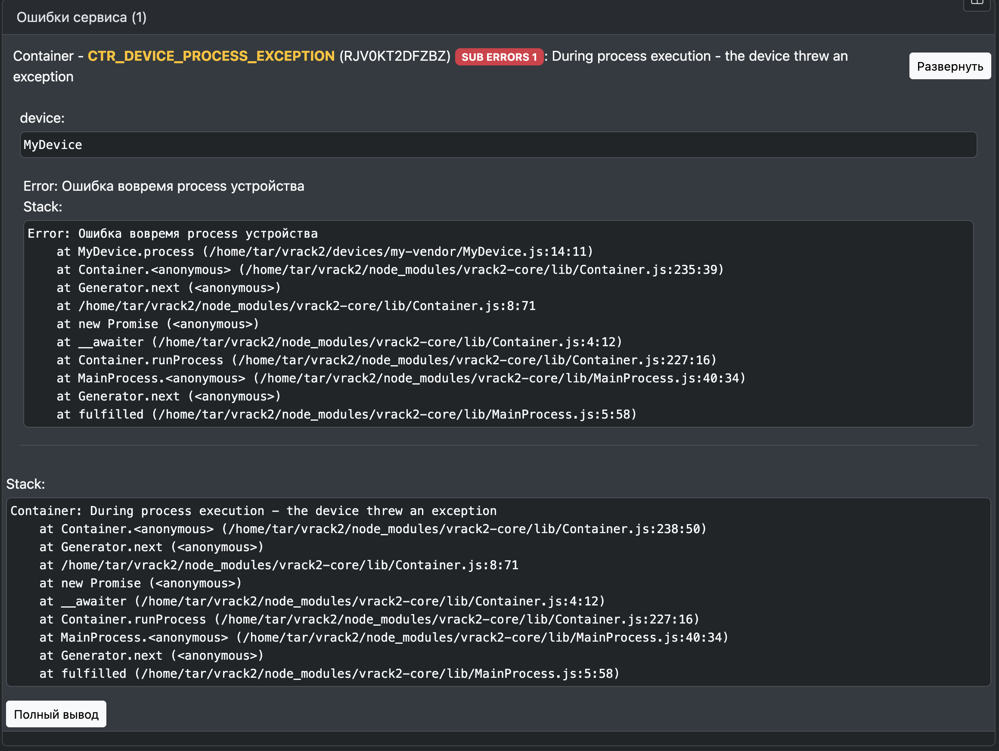

- [Обработка ошибок](#обработка-ошибок)
  - [ErrorManager](#errormanager)
  - [Регистрация ошибки](#регистрация-ошибки)
  - [Создание ошибки](#создание-ошибки)
  - [Вложенные ошибки](#вложенные-ошибки)
  - [Экспорт и импорт ошибок](#экспорт-и-импорт-ошибок)
  - [Хелперы](#хелперы)

# Обработка ошибок

Централизованная система обработки ошибок VRack2 предоставляет:

- **Стандартизированный формат** ошибок для всех модулей
- **Вложенность ошибок** для детальной диагностики цепочек сбоев
- **Сериализацию** для передачи между сервисами и клиентами (например, веб-интерфейсом)
- **Документированные данные** в каждой ошибке


## ErrorManager
Центральный класс для управления ошибками, который:

- **Регистрирует** все типы ошибок до их использования
- **Создает** ошибки типа `vrack2-core.CoreError`
- **Предоставляет** дополнительные методы для работы с ошибками

**Преимущества** создания ошибок через ErrorManager:

* Уникальный идентификатор для быстрого поиска  
* Четкое разделение ошибок VRack2 от системных  
* Поддержка вложенных ошибок  
* Документированные дополнительные данные  

## Регистрация ошибки

```js
import { ErrorManager, Rule } from "vrack2-core";

ErrorManager.register(
  'Master',                  // Владелец (обычно название класса)
  'ZEAJYEQFWCUM',            // Уникальный ID (9-18 символов, может быть хеш)
  'MASTER_ACCESS_DENIED',    // Читаемый код (рекомендуется префикс вендора)
  'Требуется повышение уровня доступа', // Описание
  {                          // Схема дополнительных данных
    level: Rule.number().description('Требуемый уровень доступа')
  }
)
```

Важные правила:

1. Регистрация происходит при первом импорте файла
2. Названия дополнительных полей не должны конфликтовать со стандартными (stack, message)
3. Для описания полей используется `Rule`

## Создание ошибки

Ошибки создаются по их человекочитаемому коду:

```js
// Создание ошибки с дополнительными данными
const error = ErrorManager.make('MASTER_ACCESS_DENIED', { 
  level: command.level 
});

// Можно сразу выбрасывать исключение
throw ErrorManager.make('MASTER_ACCESS_DENIED', { level: command.level });
```

## Вложенные ошибки

VRack2 поддерживает цепочки вложенных ошибок для детализации проблем.

Например, если в `process` устройства произойдет ошибка - она будет перехвачена и обернута в `CTR_DEVICE_PROCESS_EXCEPTION`. Из текста ошибки будет понятно, что произошло исключение во время запуска `process`.

В VRack2 Manager можно посмотреть вложенные ошибки


Пример полного вывода ошибки:

```json
{
  "stack": "Container: During process execution - the device threw an exception\n ... далее весь стектрейс",
  "message": "During process execution - the device threw an exception",
  "vError": true,
  "vCode": "RJV0KT2DFZBZ",
  "vShort": "CTR_DEVICE_PROCESS_EXCEPTION",
  "vAdd": [
    "device"
  ],
  "vAddErrors": [
    {
      "stack": "Error: Ошибка вовремя process устройства\n    at MyDevice.process (/home/tar/vrack2/devices/my-vendor/MyDevice.js:14:11)\n ... далее весь стектрейс",
      "message": "Ошибка вовремя process устройства"
    }
  ],
  "name": "Container",
  "device": "MyDevice"
}
```


**Структура CoreError:**

| Поле         | Описание                                  | Пример значения        |
|--------------|------------------------------------------|------------------------|
| `stack`      | Полный стек вызовов                      | "Container: During..." |
| `message`    | Основное сообщение                       | "Access denied"        |
| `vError`     | Флаг ошибки VRack2                       | `true`                 |
| `vCode`      | Уникальный код                           | "RJV0KT2DFZBZ"         |
| `vShort`     | Читаемый код                             | "CTR_DEVICE_ERROR"     |
| `vAdd`       | Список дополнительных полей              | `["device", "level"]`  |
| `vAddErrors` | Массив вложенных ошибок                  | `[{...}]`              |
| `device`     | Пример дополнительного поля              | "MyDevice"             |


**Пример обработки с вложением:**

```js
try {
  this.devices[key].process();
} catch (error) {
  throw ErrorManager.make('CTR_DEVICE_PROCESS_EXCEPTION', { 
    device: key 
  }).add(error); // Добавление вложенной ошибки
}
```

## Экспорт и импорт ошибок

Для передачи ошибок клиенту или для отправки ошибки между сервисами - необходимо преобразовать её в обычный объект.

Экспорт ошибки в объект:

```js
const error = ErrorManager.make('MASTER_NO_REQ_DATA');
const serialized = error.export(); // Подготовка к передаче

// Альтернативный способ:
const alternative = CoreError.objectify(error);
```

Импорт ошибки из объекта:

```js
// Создаем CoreError и импортируем объект ошибки в него
const restoredError = new CoreError(
  'name', 'message', 'code', 'short'
).import(serialized);
```

**Примечание:** Сериализованные ошибки безопасны для преобразования в JSON.

## Хелперы

Проверка, что ошибка является объектом `CoreError`: 

```ts
ErrorManager.isError(error: any): boolean
```

Проверка, что это конкретная ошибка:

```ts
ErrorManager.isCode(error: any, code: string): boolean
```

Поддерживает и код ошибки и строковую константу:

```ts
if (ErrorManager.isCode(error, 'qNOQIWHGFOIUsadjph')) {}
if (ErrorManager.isCode(error, 'EM_ERROR_CONVERT')) {}
```
