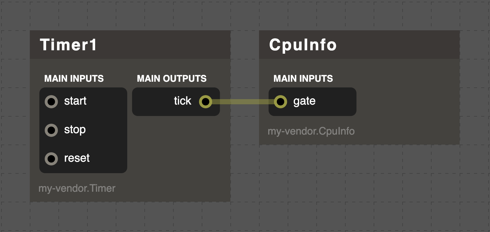
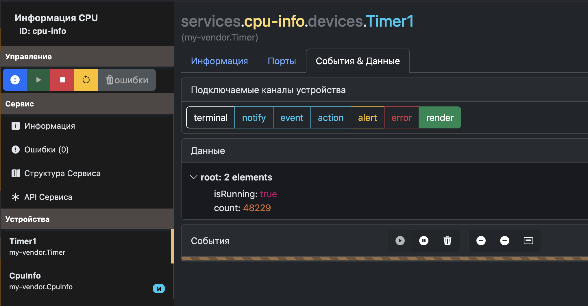
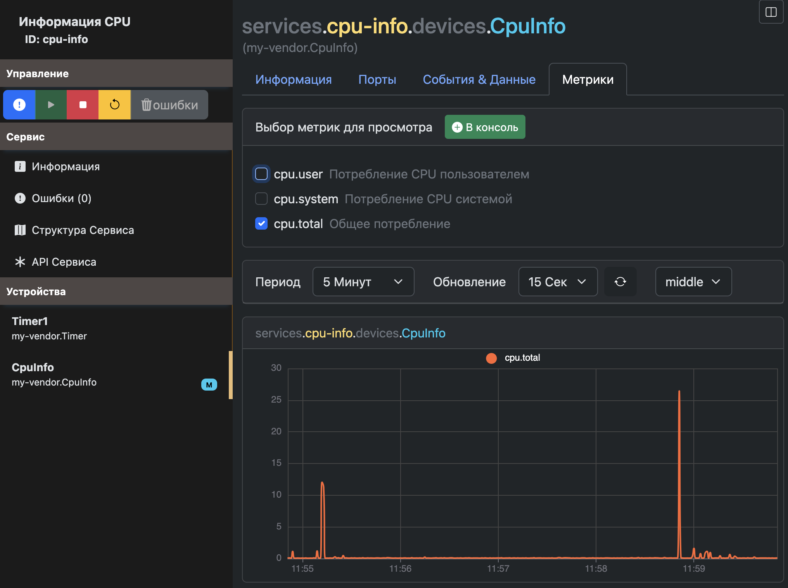
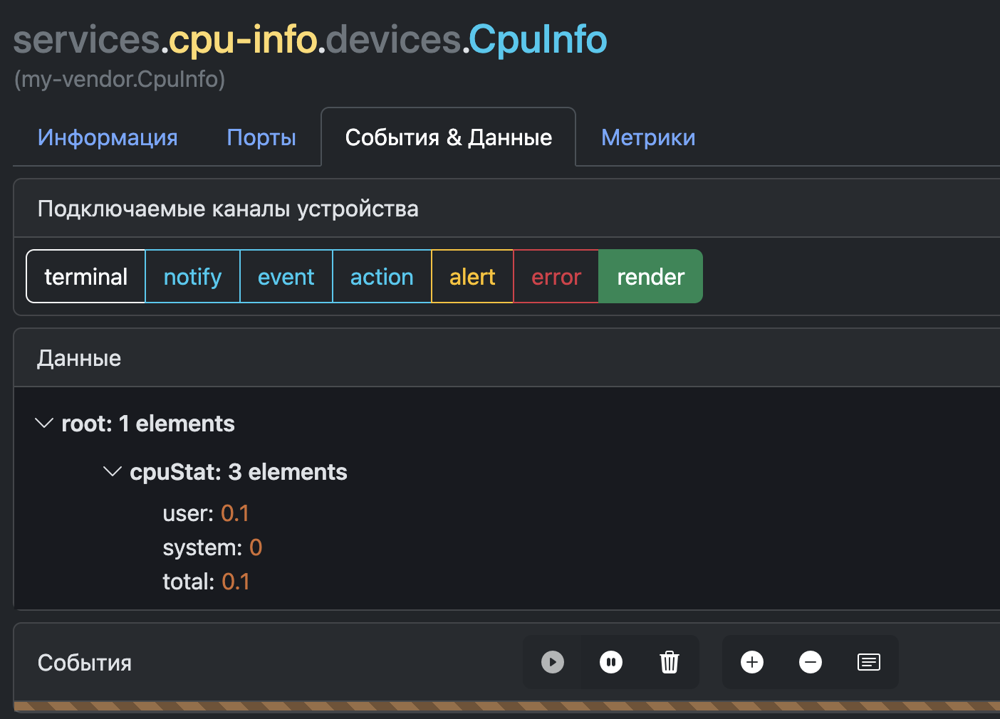
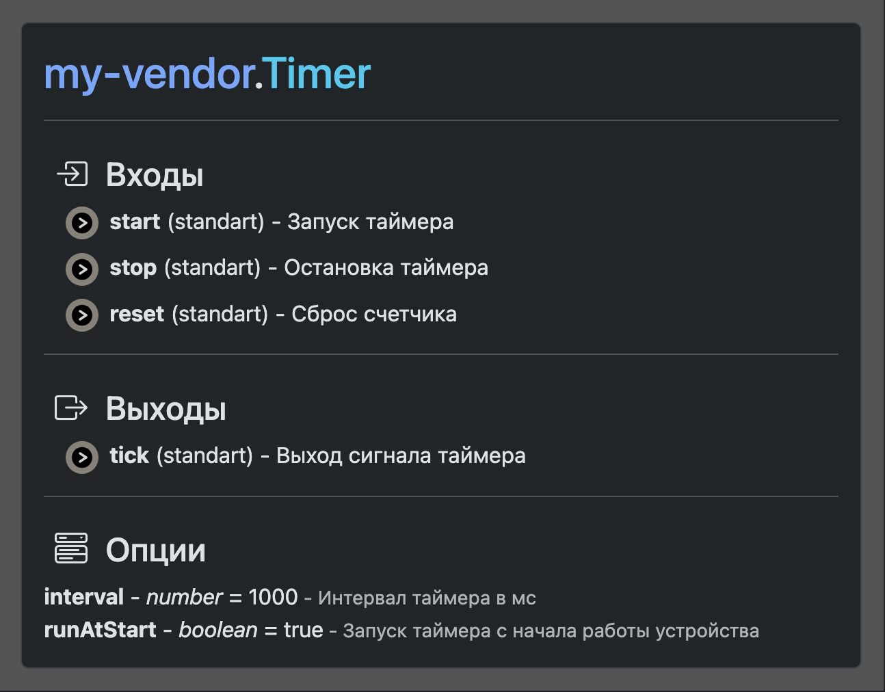

# Первый сервис

Для быстрой адаптации в VRack2, напишем простой сервис.

Вы уже установили VRack2 например в директорию `/opt/vrack2-service` будем считать это корневой директорией.

Рекомендуется так же установить [VRack2 Manager](https://github.com/VRack2/vrack2-manager) для мониторинга и отладки.

Создадим простой сервис, но постараемся затронуть часть базового функционала. 

Начнем с простого устройства `Timer` задача которого через определенный интервал вызывать события других устройств.

## Timer

Что бы создать новое устройство - нам необходимо создать директорию вендора (новый набор устройств). Все директории вендора распологаются в директории `devices`. После установки, там у вас должна быть директория `vrack2`.

Создайте в директории `devices` папку с имененм `my-vendor`. Вы можете выбрать любое имя вендора, но необходимо следовать правилам именования, рекомендуется пока оставить `my-vendor`.

В директории вендора создайте файл `Timer.js` с содержимым: 

```js
const { Device } = require("vrack2-core");

class Timer extends Device {

}

module.exports = Timer;
```

Пока устройство не будет ничего делать, постепенно дополним его.

Для регистрации в системе - создайте в директории вендора файл `list.json` с содержанием:

```json
["Timer"]
```

В итоге структура файлов должна быть такой:

```
    devices/
        my-vendor/
            list.json
            Timer.js
        vrack2/
    ...
```


Теперь разберемся с тем, что должно делать устройство:

 1. Вход `start` запускает работу таймера
 2. Вход `stop` останавливает таймер
 3. Вход `reset` сбрасывает счетчик таймера
 4. Отправка на выход `tick` сигнала для вызова событий других устройств
 5. Отправка онлайн данных работы таймера


### Добавление портов

Порты обеспечивают взаимодействие между устройствами, выполняя две функции:

 - Входящие порты используются для вызова обработчика и приёма входящих данных.
 - Исходящие порты используются для отправки данных и вызова обработчиков на других устройствах.

Исправим файл `Timer.js`: 

```js
const { Device, Port } = require("vrack2-core");

class Timer extends Device {

    /**
     * Метод должен вернуть список входящих портов устройства
     * */ 
    inputs() {
        return {
            'start': Port.standart().description('Запуск таймера'),
            'stop': Port.standart().description('Остановка таймера'),
            'reset': Port.standart().description('Сброс счетчика'),
        }
    }
    /**
     * Метод должен вернуть список исходящих портов устройства
     * */
    outputs() {
        return {
            'tick': Port.standart().description('Выход сигнала таймера')
        }
    }

    /**
     * Обработчик входа `start`. 
    */
    inputStart() {}

    /**
     * Обработчик входа `stop`. 
    */
    inputStop() { }

    /**
     * Обработчик входа `reset`. 
    */
    inputReset(){}
}


module.exports = Timer;
```

Есть 2 типа портов - стардартный и возвращаемый. 

Тип `Port.standart()` - означает, что мы используем стандартный тип порта. Такие порты используются для вызова события устройства и передачи данных в него. 

Тип - `Port.return()` - используется, когда порт должен возвращать значение. Разные типы портов не совместимы между друг другом.

Для каждого входящего порта - мы обязаны добавить обработчик.  Название метода внутри класса назначается автоматически по названию входа. Например для порта `set.time` - `inputSetTime`. Правила именование портов есть в соотвесвующем разделе документации - [Разработка своих устройств](./Devices.md)

Позже напишем логику для обработчиков портов.

### Параметры

Каждое отдельное устройство может иметь индивидуальные параметры, которые передаются из файла сервиса. 

Для устройства `Timer.js` понадобяться 2 параметра:

 - **interval** *number* - Интервал таймера
 - **runAtStart** *boolean* - Будет ли запущен таймер сразу после запуска устройства
  
Переопределим метод в нашем устройстве:

```js
// Исправим наш импорт теперь нам понадобится класс Rule
const { Device, Port, Rule } = require("vrack2-core");

// ... Определение класса и тп 

    /**
     * Метод должен вернуть список правил валидации для параметров устройства
    */
    checkOptions() {
        return {
            interval: Rule.number().default(1000).min(10).max(60000 * 24).description('Интервал таймера в мс'),
            runAtStart: Rule.boolean().default(true).description('Запуск таймера с начала работы устройства')
        }
    }

// ... Другие методы класса 

module.exports = Timer;
```

Переопределение метода `checkOptions()` класса `Device` позволяет указать правила валидации параметров из файла сервиса. 

Теперь внутри устройства нам будут доступны провалидированные параметры через `this.options.interval`, `this.options.runAtStart`.


### Дописываем `Timer.js`

Допишем логику, итоговый код устройства:

```js
const { Device, Port, Rule } = require("vrack2-core");

class Timer extends Device {

    /** Метод должен вернуть список входящих портов устройства */ 
    inputs() {
        return {
            'start': Port.standart().description('Запуск таймера'),
            'stop': Port.standart().description('Остановка таймера'),
            'reset': Port.standart().description('Сброс счетчика'),
        }
    }

    /** Метод должен вернуть список исходящих портов устройства */
    outputs() {
        return {
            'tick': Port.standart().description('Выход сигнала таймера')
        }
    }

    /** Метод должен вернуть список правил валидации для параметров устройства */
    checkOptions() {
        return {
            interval: Rule.number().default(1000).min(10).max(60000).description('Интервал таймера в мс'),
            runAtStart: Rule.boolean().default(true).description('Запуск таймера с начала работы устройства')
        }
    }

    // Эти данные мы сможем наблюдать в онлайн режиме
    shares = {
        isRunning: false,
        count: 0
    }
    
    // Ссылка на рабочий таймер 
    timer = null

    // Метод будет запущен при старте устройства
    process() {
        // Если runAtStart = true - значит запускаем таймер сразу
        if (this.options.runAtStart) this.inputStart()
        this.render(); // Отправляем shares данные для онлайн наблюдения
    }

    /**
     * Обработчик порта `start`. 
     * Данный метод будет запускаться каждый раз, когда на вход start будут поступать данные
    */
    inputStart() {
        if (this.timer) return        // Если таймер уже запущен - игнорируем сигнал
        this.shares.isRunning = true; // Правим онлайн данные
        this.render();                // Отправляем онлайн данные
        // Запускаем интервал 
        this.timer = setInterval(() => { 
            this.shares.count++;      // Прибавляем счетчик
            this.ports.output.tick.push(this.shares.count); // Отправляем на выход `tick` значение счетчика
            this.render();            // Отправляем онлайн данные
        }, this.options.interval);
    }

    /**
     * Обработчик порта `stop`. 
     * Данный метод будет запускаться каждый раз, когда на вход stop будут поступать данные
    */
    inputStop() {
        this.shares.isRunning = false; // Правим онлайн данные
        clearInterval(this.timer);     // Останавливаем интервал
        this.timer = null;             // Обнуляем ссылку на рабочий таймер
        this.render();                 // Отправляем онлайн данные
    }

    /**
     * Обработчик порта `reset`. 
    */
    inputReset(){
        this.shares.count = 0          // Обнуляем счетчик
        this.render()                  // Отправляем онлайн данные
    }
}


module.exports = Timer;
```

## CpuInfo

В директории вендора создайте файл `CpuInfo.js` с содержимым: 


```js
const { Device } = require("vrack2-core");

class CpuInfo extends Device {

}

module.exports = CpuInfo;
```

Что бы зарегистрировать наше устройство в системе - необходимо отредактировать файл `list.json`:

```json
["Timer", "CpuInfo"]
```


В итоге структура файлов должна быть такой:

```
    devices/
        my-vendor/
            CpuInfo.js
            list.json
            Timer.js
        vrack2/
    ...
```

Разберемся с тем, что должно делать наше устройство:

 1. Вход `gate` будет инициировать событие для подсчета потребления CPU
 2. Отправка онлайн данных для просмотра последних полученых значений
 3. Отправка метрик для просмотра графиков потребления

### Добавление портов

```js
const { Device, Port } = require("vrack2-core");

class CpuInfo extends Device {

    /**
     * Метод должен вернуть список входящих портов устройства
     * */ 
    inputs() {
        return {
            'gate': Port.standart().description('Принимает сигнал для посчета информации о CPU')
        }
    }

    /**
     * Обработчик порта `gate`. 
    */
    inputGate(){

    }
}

module.exports = CpuInfo;
```

Позже напишем логику для обработчиков портов.


### Добавление метрик

Каждое устройство может иметь свои собственные метрики которые можно просматривать, например используя [VRack2 Manager](https://github.com/VRack2/vrack2-manager).

Переопределим метод в нашем устройстве:


```js
// Исправим наш импорт теперь нам понадобится класс Metric
const { Device, Port, Metric } = require("vrack2-core");

// Опредение класса и тп

    /** Должен вернуть список метрик */
    metrics() {
        return {
            'cpu.user': Metric.inS().retentions('1s:10m, 5s:2h, 15s:1d').description('Потребление CPU пользователем'),
            'cpu.system': Metric.inS().retentions('1s:10m, 5s:2h, 15s:1d').description('Потребление CPU системой'),
            'cpu.total': Metric.inS().retentions('1s:10m, 5s:2h, 15s:1d').description('Общее потребление')
        }
    }

```

VRack2 для хранение метрик использует базу данных [VRackDB](https://github.com/ponikrf/VRackDB/wiki/RU%E2%80%90DOC%E2%80%90V3.0).

Определение `Metric.inS()` сообщает, что время метрики храниться в секундах. `retentions('1s:10m, 5s:2h, 15s:1d')`- определяет длительность и точность хранения.

Для лучшего опыта рекомендуется ознакомится с документацией [VRackDB](https://github.com/ponikrf/VRackDB/wiki/RU%E2%80%90DOC%E2%80%90V3.0).


### Дописываем `CpuInfo.js`

```js
// Исправим наш импорт теперь нам понадобится класс Metric
const { Device, Port, Metric } = require("vrack2-core");
const process = require('process');

class CpuInfo extends Device {

    /** Метод должен вернуть список входящих портов устройства */ 
    inputs() {
        return {
            'gate': Port.standart().description('Принимает сигнал для посчета информации о CPU')
        }
    }

    /** Должен вернуть список метрик */
    metrics() {
        return {
            'cpu.user': Metric.inS().retentions('1s:10m, 5s:2h, 15s:1d').description('Потребление CPU пользователем'),
            'cpu.system': Metric.inS().retentions('1s:10m, 5s:2h, 15s:1d').description('Потребление CPU системой'),
            'cpu.total': Metric.inS().retentions('1s:10m, 5s:2h, 15s:1d').description('Общее потребление')
        }
    }


    // Заполняем онлайн данные
    shares = {
        cpuStat: { user: 0, system: 0, total: 0 }
    }

    /** Обработчик порта `gate`. */
    inputGate(){
        const cpuStat = this.getCPUUsage()
        // Запись метрик
        this.metric('cpu.user', cpuStat.user)
        this.metric('cpu.system', cpuStat.system)
        this.metric('cpu.total', cpuStat.total)

        // Правим онлайн данные
        this.shares.cpuStat = cpuStat 
        this.render() // Отправляем онлайн данные
    }

    lastCPUUsage = process.cpuUsage(); // { user, system }
    lastCheck = Date.now();

    /**
     * Возвращает объект с информацией потребления CPU
     * { user: number, system: number, total: number }
    */
    getCPUUsage() {
        const currentCPUUsage = process.cpuUsage(this.lastCPUUsage);
        const currentTime = Date.now();
        const timeDiff = (currentTime - this.lastCheck) / 1000; // в секундах
        
        this.lastCPUUsage = process.cpuUsage();
        this.lastCheck = currentTime;
        
        // Микросекунды в миллисекунды, затем в проценты
        const userPercent = (currentCPUUsage.user / 1000) / (timeDiff * 10);
        const systemPercent = (currentCPUUsage.system / 1000) / (timeDiff * 10);
        const totalPercent = userPercent + systemPercent;
        
        return {
            user: Math.min(100, Math.round(userPercent * 100) / 100),
            system: Math.min(100, Math.round(systemPercent * 100) / 100),
            total: Math.min(100, Math.round(totalPercent * 100) / 100)
        };
    }
}

module.exports = CpuInfo;
```

## Сервис файл

Для запуска устройств, нам необходимо добавить их в сервис файл. Обычно, все сервис файлы лежат в директории `./services`. Подробнее о работе с сервис файлами можно узнать из документа [Сервис-файл](./ServiceFile.md)

Создадим файл `cpu-info.json`  в директории `./services` с содержимым:

```json
{
	"devices": [
		{
			"id": "Timer1",
			"type": "my-vendor.Timer",
			"options": {
                "interval": 1000,
                "runAtStart": true
            },
            "connections": [
                "Timer1.tick -> CpuInfo.gate"
            ]
		},
        {
			"id": "CpuInfo",
			"type": "my-vendor.CpuInfo",
			"options": {}
		}
	]
}
```

Может показаться, что структура сервис файла сложная. Но она состоит из простых и однообразных блоков. Сервис файл перечисляет устройства для запуска, их параметры и соединения. Можно добавлять сколько угодно устройств одного типа, назначая им уникальные идентификаторы.

Сервис `cpu-info` не запустится сам после запуска VRack2. Что бы он запускался - нам необходимо указать дополнительные мета данные.

Создадим файл `cpu-info.meta.json`  в директории `./services` с содержимым:

```json
{
    "name": "Информация CPU",
    "group": "сервисы",
    "autoStart": true,
    "autoReload": true,
    "description": "Позволяет посмотреть информацию о потреблении CPU",
}
```

Мета данные позволяют указать дополнительные данные и  настройки сервиса. Теперь VRack2 попытается запустить сервис сразу после запуска.

## Запуск и тестирование

Теперь пришло время запускать сервис, запустив VRack2:

Переходим в директорию установки vrack2:

```bash
cd /opt/vrack2-service
```

И запускаем:
```bash
npm run start
```

Сервис `cpu-info` запустится сам. Теперь воспользуемся [VRack2 Manager](https://github.com/VRack2/vrack2-manager).

Для начала можно заглянуть в структуру сервиса:



Если подписаться на канал `render` устройства `Timer1` можно в онлайн режиме наблюдать, как будет меняться зачение `count`:



Интереснее дела обстоят с устройством CpuInfo. Там мы можем посмотреть в онлайн режиме данные и графики:



Данные на текущий момент:



В VRack2 устройства автоматически документируются, когда вы указываете их параметры/порты/метрики и тп. 

Вот пример того, что сформирует нам **VRack2 Manager** в качестве документации на устройство `Timer`:




## Заключение

Хоть данный сервис и является очень простым, он так же является и очень базовым. Большенство сервисов работают по тому же принципу - кто то является триггером, а кто то выполняет работу.

Примеров таких сервисом много, например, одно устройство отслеживает занимаемое место, а другое сообщает о том что места больше нет.

Если хотите лучше разобраться с VRack2 рекомендуется ознакомться с:

 - [Еще примеры учебных сервисов](https://github.com/VRack2/vrack2-example)
 - [Разработка своих устройств](./Devices.md)
 - [Написание Сервис-файла](./ServiceFile.md)
 - [README VRack2](../README.md)
 - [VRack2 Manager](https://github.com/VRack2/vrack2-manager)