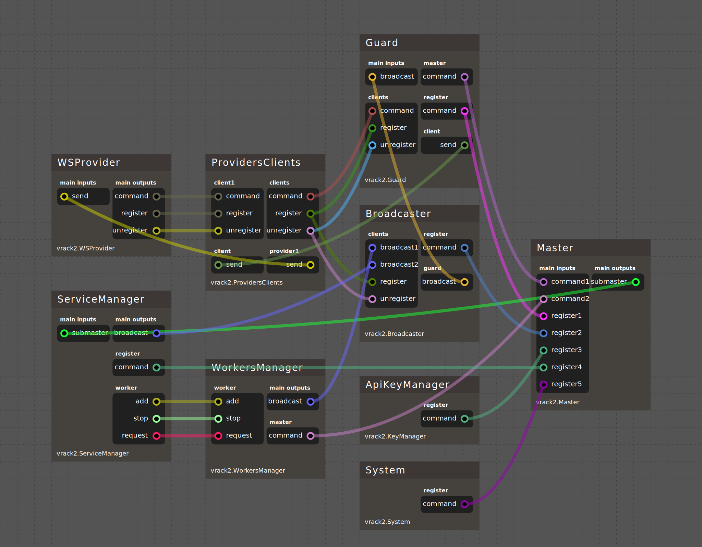

- [Введение](#введение)
  - [Почему TypeScript/JavaScript?](#почему-typescriptjavascript)
  - [VRack2 Core](#vrack2-core)
    - [Структура сервиса](#структура-сервиса)
    - [Компоненты (устройства)](#компоненты-устройства)
    - [Библиотеки](#библиотеки)
  - [VRack2](#vrack2)
    - [VRack2 vs. NodeRed и аналоги](#vrack2-vs-nodered-и-аналоги)
    - [Концепция устройств vs. "нод"](#концепция-устройств-vs-нод)
  - [Заключение](#заключение)

# Введение  

## Почему TypeScript/JavaScript?

VRack2 использует платформу Node.js/Bun и язык TypeScript/JavaScript.

В сообществе существует определённый скепсис по поводу применения JavaScript для серверного кода. Отсутствие строгой типизации и "Callback Hell" в прошлом отпугивали многих разработчиков. Однако с появлением TypeScript, классов и async/await эти проблемы остались в прошлом.  

Но зачем выбирать JavaScript, если есть другие языки? Ответ прост: **JavaScript крайне дешевый в использовании**. JavaScript **легко изучать**, он **прост** и очень **компактен**, но самое главное - это **полная асинхронность** и **работа EventLoop**. 

Например, чтобы следить за изменениями в двух папках, достаточно такого кода:

```js  
require('fs').watch('/path/to/folder1', (eventType, filename) => {  
  // Срабатывает при изменениях в folder1  
  console.log(eventType, filename); // Выводит тип события и имя файла  
});  

require('fs').watch('/path/to/folder2', (eventType, filename) => {  
  // Срабатывает при изменениях в folder2
  console.log(eventType, filename); 
});  

```  

Здесь обработчики реагируют на события автоматически. Если вы привыкли к синхронному коду, это может быть непривычно. Но суть в том, что вам не нужно контролировать весь процесс — вы просто указываете, как реагировать на события.

**Проще говоря**, ваше приложение может одновременно:  
- обрабатывать HTTP-запросы,  
- выполнять системные команды,  
- взаимодействовать с базой данных,  
- управлять очередями задач,  
и всё это — в рамках одного потока.  

Такой стиль программирования основан на событиях: вместо сложного кода достаточно описать реакцию на событие.  

Ещё одно преимущество Node.js/Bun — богатая стандартная библиотека. Иногда можно создать серьёзный сервис без внешних зависимостей. Сам VRack2 пока использует только одну — WebSocket-сервер (`ws`), но в будущем от неё тоже можно будет отказаться (в новых версиях nodejs уже есть встроенный WebSocket Server). 

Сервисы на чистом JavaScript/TypeScript писать возможно, но сложно, особенно при масштабировании. Со временем становится трудно отслеживать взаимодействие компонентов и событий. **VRack2 Core решает эту проблему**.  

## VRack2 Core

VRack2 Core — это фреймворк для создания событийно-ориентированных сервисов на JavaScript/TypeScript. Он задаёт правила организации кода, структуру файлов и предоставляет базовые компоненты для их реализации. Сам VRack2 это сервис который написан на VRack2 Core.  

Сервис написанный на VRack2 Core строится на трёх основных элементах:  

1. **Структура сервиса** — определяет взаимодействие компонентов.  
2. **Компоненты (устройства)** — содержат исполняемую логику.  
3. **Библиотеки (опционально)** — вспомогательные модули.  

### Структура сервиса

Описывается в конфигурационном файле, где перечислены компоненты, их настройки и связи.  

Пример упрощённого файла:  

```  
Компонент1:  
  Тип: Вендор1.Тип1  
  Параметры:  
    Параметр1: Значение1  
    Параметр2: Значение2  
  Соединения:  
    Компонент1.выход1 -> Компонент2.вход1  

Компонент2:  
  Тип: Вендор1.Тип2  
```  

Файл структуры всегда выглядит единообразно, поэтому его легко писать и генерировать.

Внутри не происходит никаких чудес. При запуске создаются экземпляры классов компонентов (устройств) и подписываються события одного устройства на обраобтчики событий другого.

Такой подход удобен тем, что **позволяет расширять функционал** сервиса без изменения кода устройств и позволяет формировать **графическое представление сервиса**

Например, вот графическое представление самого VRack2 из приложения для администрирования VRack2 Manager:



Удобно когда у вас есть графическое представление взаимодействия компонентов между друг другом.

Чем это помогает в работе:

 - Проще возвращаться к старым проектам/сервисам, проще вспомнить что и как работает по схеме
 - Проще объяснить принцип работы сервиса
 - Проще искать точки входа для расширения функционала
 - Поскольку схема формируется на основе фактически выполняемого файла - происходит автодокументирования сервиса, вы видите то - что фактически работает

Может показаться, что это очередная поделка для "умного дома" или Flow система по типу NodeRED. Связи между компонентами создают такие ассоциации, но концептуальные отличия кроются в компонентах (устройствах) и способах взаимодействия.

### Компоненты (устройства)

Это классы, реализующие логику сервиса. Их ключевые элементы:  
- **Входы** — точки для вызова событий внутри компонента.  
- **Выходы** — точки для генерации событий для других компонентов.  
- **Параметры** — правила проверки конфигурации.  

**Связи между компонентами**  
Строка в файле сервиса `Компонент1.выход1 -> Компонент2.вход1` задаёт передачу событий между компонентами. Это основа взаимодействия компонентов в сервисе. При вызове события, устройство может передавать необходимые данные, причем устройство никак не ограничено в типе передаваемых данных. Могут передаваться как примитивные числа, так и сложные объекты.

**Почему** их все же **назвали устройствами а не компонентами**, что было бы более привычно для восприятия. Дело в том, компоненты имеют очень схожый функционал с устройствами из реального мира. 

Вот ключевые особенности устройств: 
  - Имеют порты для взаимодействия друг с другом
  - Могут иметь "дисплей" для отображения данных в онлайн режиме
  - Имеют органы управления для взаимодействия с ними за пределами сервиса (WEB интерфейс и подобное)
  - Могут хранить свое индивидуальное состояние
  
Помимо этого устройства могут:
  - Отправлять метрики своей работы, например значение портов при опросе реального устройства, метрики производительности или проделанной работы
  - Отправлять внутренние события, на которые могут быть подписаны внешние источники. Таким образом можно следить за событиями устройств и реагировать на них, или использовать их для отслежиания работы сервиса и логгирования.
  
Эти ключевые особенности позволяют создавать **отличные абстракции реальных устройств или сервисов**, что является просто киллер-фитчей для локальной автоматизации.

Далее компоненты будут зваться устройствами.

### Библиотеки  

Устройства обычно устанавливаются наборами. Наборы могут включать дополнительные JavaScript модули. Устройства не ограничены в функциональности и поддерживают все возможности интерпретируемого приложения. Такой подход позволяет изолировать зависимости, избегая "захламления" общей папки `node_modules`.

Чаще всего, набор устройств это отдельный репозиторий, что позволяет хорошо контролировать версионность устройств и быстро переключаться между версиями.

## VRack2  

VRack2 запускает и управляет сервисами, написанными на VRack2 Core, значительно расширяя их возможности: предоставляет API, мониторинг, метрики и другие инструменты. 

 **Для VRack2 можно установить веб интерфейс - VRack2 Manager**, который можно использовать для разрабоки, мониторинга, отладки, взаимодействия с устройствами, просмотра графического представления схемы сервиса, просмотра API (В VRck2 доступное API динамическое и зависит от набора компонентов). Рекомендуется заглянуть на [страницу проекта](https://github.com/VRack2/vrack2-manager) для ознокомления с функционалом интерфейса.

Поскольку VRack2 сам построен на VRack2 Core, **у него тоже есть файл структуры, компоненты и библиотеки**. Это означает, что вы можете:  
- расширять функционал VRack2, добавляя свои компоненты без изменения исходного кода,  
- использовать компоненты VRack2 в своих сервисах.  

Это демонстрирует состоятельность концепции, ведь вы уже получаете полноценный сервис написанный на VRack2 - это сам VRack2.

### VRack2 vs. NodeRed и аналоги  

Важно отличать VRack2 от таких решений, как NodeRed или платформ для умного дома. Вот ключевые отличия от NodeRed:  

1. Минималистичный сервис
   - VRack2 не требует для работы никаких веб интерфейсов или приложений. VRack2 Manager используется обычно только для разработки, отладки и мониторинга, в более редких случаях - для ручного взаимодействия с устройствами.
  
2. Гибкость архитектуры
   - VRack2 Core не ограничивает разработчика жёсткими паттернами (например, потоками данных).  
   - Компоненты и события можно свободно комбинировать.  

3. Контроль над кодом
   - Структура сервиса описывается явно (JSON/JavaScript), что упрощает:  
   - интеграцию с CI/CD, код-ревью, версионирование изменений.  

4. Производительность
   - VRack2 работает практически на уровне "чистого" JavaScript, минимизируя оверхед.  
   - Компоненты можно тонко оптимизировать под конкретные задачи.  

5. Масштабируемость
   - Модульная архитектура позволяет распределять компоненты между сервисами без переписывания кода.  

6. Интеграция с экосистемой JS
   - Поддерживается прямое использование любых npm-пакетов, нативного кода (например, через FFI).  

### Концепция устройств vs. "нод"  

В отличие от визуального программирования, **VRack2 не поощряет чрезмерное дробление логики на мелкие узлы**, которые затем превращаются в сложную паутину связей. Хорошим примером являеться схема самого VRack2, которая представлена выше.

Может показаться, что это может стать фатальным недостатком концепции и подобная система вас будет сильно ограничивать. Но как показывает практика, даже достаточно неудобные на первый взгляд сервисы - по итогу отлично укладываются в концепцию устройств и работают очень надежно.

## Заключение 

VRack2 и его ядро — VRack2 Core — предлагают принципиально новый подход к созданию событийно-ориентированных сервисов на TypeScript/JavaScript. В отличие от традиционных решений вроде NodeRed, VRack2 сочетает в себе гибкость, производительность и масштабируемость, сохраняя при этом простоту разработки.

Если вы ищете инструмент для автоматизации, мониторинга или разработки сложных сервисов — VRack2 предлагает устойчивую архитектуру, которую можно адаптировать под любые задачи, от умного дома до промышленных решений.

Если хотите лучше разобраться с VRack2 рекомендуется ознакомться с:

 - [README VRack2](../README.md)
 - [VRack2 Manager](https://github.com/VRack2/vrack2-manager)
 - [Установка](./Install.md)
 - [Пишем свой первый сервис](./First-service.md)
 - [Еще примеры учебных сервисов](https://github.com/VRack2/vrack2-example)
 - [Разработка своих устройств](./Devices.md)
 - [Написание Сервис-файла](./Service-File.md)