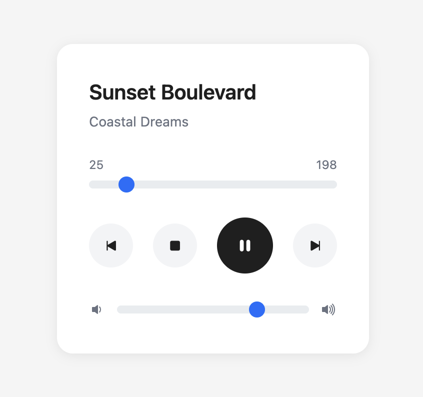

# Сервис "Музыкального плеера"

Цель данного гайда - показать на примере, как можно управлять и взаимодействовать с устройствами внутри VRack2.

Напишем музыкальный плеер, он будет делать вид, что проигрывает музыку на сервере. 

Для начала мы напишем устройство плеера, после чего напишем очень простой интерфейс для работы с ним.

Вы уже установили VRack2 в директорию `/opt/vrack2-service` (по умолчанию) будем считать это корневой директорией.

## MusicPlayer

Что бы создать новое устройство - нам необходимо создать директорию вендора (новый набор устройств). Все директории вендоров распологаются в директории `devices`. После установки, там у вас должна быть директория `vrack2`.

Создайте в директории `devices` папку с имененм `my-music-player`.

В директории вендора создайте файл `MusicPlayer.js` с содержимым: 

```js
const { Device } = require("vrack2-core");

class MusicPlayer extends Device {
  // Тут будет логика
}

module.exports = MusicPlayer;
```

Для регистрации в системе - создайте в директории вендора файл `list.json` с содержанием:

```json
["MusicPlayer"]
```

В итоге структура файлов должна быть такой:

```
    devices/
        my-music-player/
            list.json
            MusicPlayer.js
        vrack2/
    ...
```

Теперь разберемся с самим устройством. **Выделим только важные части**, после чего просто **возмем готовый код устройства**. 

### Параметры при запуске

Добавим возможность настроить параметры при старте — включить автоплей или задать громкость:

```js
checkOptions() {
  return {
    autoplay: Rule.boolean().default(false).description('Начинать воспроизведение при старте'),
    volume: Rule.number().min(0).max(100).default(80).description('Громкость по умолчанию')
  };
}
```

Значения по умолчанию через `.default()` попадут в this.options автоматически. Не нужно проверять if (this.options.volume === undefined) — оно уже будет заполнено.

### Экшены (ограны управления)

Плеер бесполезен, если в нем нельзя тыкать кнопки. Экшены — это API устройства. Описываем их в методе actions():

```js
    actions() {
        return {
            'play': Action.global().description('Кнопка плей'),
            'pause': Action.global().description('Кнопка паузы'),
            'stop': Action.global().description('Кнопка стоп'),
            'next': Action.global().description('Кнопка переключения следующего трека'),
            'prev': Action.global().description('Кнопка переключения предидущего трека'),
            'seek': Action.global().description('Перемотка')
            .requirements({
                position: Rule.number().min(0).required().description('Позиция в секундах')
            }),
            'setVolume': Action.global().description('Установка громкости') 
            .requirements({
                volume: Rule.number().min(0).max(100).required().description('Громкость 0-100')
            })
        };
    }
```

### Состояние через `shares`

Чтобы интерфейс видел, что происходит внутри плеера, используем shares:

```js
  // Реактивное состояние устройства - автоматически отправляется клиентам при вызове render()
  shares = {
    status: 'stopped',        // Текущий статус: 'playing' | 'paused' | 'stopped'
    currentTrack: null,       // Текущий трек (объект из tracks)
    position: 0,              // Текущая позиция воспроизведения в секундах
    volume: 100,              // Текущая громкость 0-100
  };
```

Это не просто переменные — это реактивное состояние. Как только мы меняем что-то внутри shares и вызываем this.render(), все подключённые клиенты (например, браузер с интерфейсом) мгновенно получают обновление.


### Process - запуск устройства

Когда устройство запускается - вызывается его метод `process()`. В нем мы будем задавать наше начальное состояние:

```js
process() {
    if (this.storage.volume !== undefined)
      this.shares.volume = this.storage.volume;
    else
      this.shares.volume = this.options.volume;

    // Устанавливаем первый трек из плейлиста как текущий
    this.setCurrentTrack(this.tracks[0]);

    // Если автоплей отключен - просто отрисовываем начальное состояние
    if (!this.options.autoplay) return this.render();

    // Если автоплей включен - запускаем воспроизведение
    this.actionPlay();
}
```

У устройств есть хранилище, в котором можно хранить данные, которые редко меняются. Например, было бы удобно если бы плеер запоминал какой уровень громкости мы ставили.

### Конечный код устройства

Не будем расписывать каждый экшен, у нас есть цель - создать устройство в которое можно тыкать интерфейсом что бы оно моментально на это реагировало. Вы можете изучить код устройства самостоятельно - в нем есть комментарий практически на каждую строчку.

Замените содержимое `MusicPlayer.js` готовым кодом устройства:

```js
const { Device, Rule, Action } = require("vrack2-core");

class MusicPlayer extends Device {

  // Метод описания параметров устройства
  checkOptions() {
    return {
      autoplay: Rule.boolean().default(false).description('Начинать воспроизведение при старте'),
      volume: Rule.number().min(0).max(100).default(80).description('Громкость по умолчанию')
    };
  }

  // Описание экшенов (управляющих команд) устройства
  // Для каждого экшена должен быть создан метод - обработчик
  // Прим. play - actionPlay(), set.volume - actionSetVolume()
  actions() {
    return {
      'play': Action.global().description('Кнопка плей'),
      'pause': Action.global().description('Кнопка паузы'),
      'stop': Action.global().description('Кнопка стоп'),
      'next': Action.global().description('Кнопка переключения следующего трека'),
      'prev': Action.global().description('Кнопка переключения предидущего трека'),
      'seek': Action.global().description('Перемотка')
        .requirements({
          position: Rule.number().min(0).required().description('Позиция в секундах')
        }),
      'set.volume': Action.global().description('Установка громкости')
        .requirements({
          volume: Rule.number().min(0).max(100).required().description('Громкость 0-100')
        })
    };
  }

  tracks = [
    { id: '01', title: 'Midnight Drive', artist: 'Neon Waves', duration: 245 },
    { id: '02', title: 'Sunset Boulevard', artist: 'Coastal Dreams', duration: 198 },
    { id: '03', title: 'Electric Pulse', artist: 'Synth Riders', duration: 217 },
    { id: '04', title: 'Rainy Day', artist: 'Lo-Fi Collective', duration: 263 },
    { id: '05', title: 'Stellar Journey', artist: 'Cosmic Echo', duration: 312 },
    { id: '06', title: 'Urban Rhythm', artist: 'City Beats', duration: 184 },
    { id: '07', title: 'Ocean Breeze', artist: 'Tropical Mind', duration: 229 },
    { id: '08', title: 'Neon Lights', artist: 'Retro Future', duration: 205 },
    { id: '09', title: 'Mountain Peak', artist: 'Alpine Sound', duration: 276 },
    { id: '10', title: 'Desert Mirage', artist: 'Sandy Tones', duration: 238 }
  ];

  // Интервал таймера воспроизведения (будет содержать идентификатор setInterval)
  playbackInterval = null;

  // Скорость воспроизведения (1 = нормальная скорость)
  playbackSpeed = 1;

  // Реактивное состояние устройства - автоматически отправляется клиентам при вызове render()
  shares = {
    status: 'stopped',        // Текущий статус: 'playing' | 'paused' | 'stopped'
    currentTrack: null,       // Текущий трек (объект из tracks)
    position: 0,              // Текущая позиция воспроизведения в секундах
    volume: 100,              // Текущая громкость 0-100
  };

  // Точка входа устройства - вызывается после инициализации всех соединений
  process() {
    // Восстанавливаем громкость из сохраненного состояния (storage)
    // Если ранее громкость не сохранялась - используем значение из параметров
    if (this.storage.volume !== undefined)
      this.shares.volume = this.storage.volume;
    else
      this.shares.volume = this.options.volume;

    // Устанавливаем первый трек из плейлиста как текущий
    this.setCurrentTrack(this.tracks[0]);

    // Если автоплей отключен - просто отрисовываем начальное состояние
    if (!this.options.autoplay) return this.render();

    // Если автоплей включен - запускаем воспроизведение
    this.actionPlay();
  }

  // Экшен: Кнопка плей
  async actionPlay() {
    // Если уже играет - ничего не делаем
    if (this.shares.status === 'playing') return { status: this.shares.status };
    // Меняем статус на "воспроизведение"
    this.shares.status = 'playing';
    // Запускаем таймер воспроизведения
    this.startPlayback();
    // Отправляем обновленное состояние клиентам
    this.render();
    // Возвращаем текущий статус (экшенам всегда нужно что то возвращать!)
    return { status: this.shares.status };
  }

  // Экшен: поставить на паузу
  async actionPause() {
    // Работает только если сейчас идет воспроизведение
    if (this.shares.status === 'playing') {
      // Меняем статус на "пауза"
      this.shares.status = 'paused';
      // Останавливаем таймер воспроизведения
      this.stopPlayback();
      this.render();
    }
    return { status: this.shares.status };
  }

  // Экшен: остановить воспроизведение
  async actionStop() {
    // Меняем статус на "остановлено"
    this.shares.status = 'stopped';
    // Сбрасываем позицию на начало
    this.shares.position = 0;
    // Останавливаем таймер
    this.stopPlayback();
    // Отправляем обновление
    this.render();
    return { status: this.shares.status };
  }

  // Экшен: следующий трек
  async actionNext() {
    // Находим индекс текущего трека в плейлисте
    const currentIndex = this.tracks.findIndex(t => t.id === this.shares.currentTrack.id);
    // Вычисляем индекс следующего трека (с зацикливанием)
    // % длина массива - обеспечивает возврат к началу после последнего трека
    const nextIndex = (currentIndex + 1) % this.tracks.length;
    // Устанавливаем следующий трек как текущий
    this.setCurrentTrack(this.tracks[nextIndex]);
    // Сбрасываем позицию на 0
    this.shares.position = 0;
    // Если до этого шло воспроизведение - продолжаем его
    if (this.shares.status === 'playing') this.startPlayback();

    return { status: this.shares.status };
  }

  // Экшен: предыдущий трек
  async actionPrev() {
    // Находим индекс текущего трека
    const currentIndex = this.tracks.findIndex(t => t.id === this.shares.currentTrack.id);
    // Вычисляем индекс предыдущего трека (с зацикливанием)
    // + длина массива - нужен для корректной работы с отрицательными индексами
    const prevIndex = (currentIndex - 1 + this.tracks.length) % this.tracks.length;
    // Устанавливаем предыдущий трек
    this.setCurrentTrack(this.tracks[prevIndex]);
    // Сбрасываем позицию
    this.shares.position = 0;
    // Продолжаем воспроизведение если было включено
    if (this.shares.status === 'playing') this.startPlayback();
    return { status: this.shares.status };
  }

  // Экшен: перемотка к заданной позиции
  async actionSeek(data) {
    // Устанавливаем позицию, ограничивая её диапазоном 0-длительность_трека
    // Math.max(0, ...) - не меньше 0
    // Math.min(..., duration) - не больше длительности трека
    this.shares.position = Math.min(Math.max(0, data.position), this.shares.currentTrack.duration);
    this.render();
    // Если играет - перезапускаем таймер
    if (this.shares.status === 'playing') this.startPlayback();
    return { status: this.shares.status };
  }

  // Экшен: установить громкость
  async actionSetVolume(data) {
    // Обновляем текущую громкость в состоянии
    this.shares.volume = data.volume;
    // Сохраняем в хранилище для восстановления после перезапуска
    this.storage.volume = data.volume;
    // Инициируем сохранение на диск
    this.save();
    // Отправляем обновление
    this.render();
    return { status: this.shares.status };
  }

  /**
   * Вспомогательный метод  для запуска таймера воспроизведения
   * */ 
  startPlayback() {
    // Сначала останавливаем предыдущий таймер (если был)
    this.stopPlayback();
    // Создаем новый интервал, который срабатывает каждую секунду
    this.playbackInterval = setInterval(() => {
      // Если статус не "воспроизведение" - пропускаем тик
      if (this.shares.status !== 'playing') return;
      // Увеличиваем позицию на значение скорости (обычно 1 секунда)
      this.shares.position += this.playbackSpeed;
      // Если достигли конца трека - переключаем на следующий
      if (this.shares.position >= this.shares.currentTrack.duration) this.actionNext();
      // Отправляем обновление состояния (позиция изменена)
      this.render();
    }, 1000);
  }

  // Остановка таймера воспроизведения
  stopPlayback() {
    // Если таймер существует - очищаем его
    if (this.playbackInterval) clearInterval(this.playbackInterval);
    // Обнуляем ссылку на таймер
    this.playbackInterval = null;
  }

  // Установить текущий трек и обновить состояние
  setCurrentTrack(track) {
    // Записываем трек в состояние
    this.shares.currentTrack = track;
    // Сбрасываем позицию на начало
    this.shares.position = 0;
    // Отправляем обновление клиентам
    this.render();
  }
}

// Экспортируем класс для использования в системе
module.exports = MusicPlayer;
```

### Сервис файл

Для запуска устройства, нам необходимо добавить его в сервис файл. Обычно, все сервис файлы лежат в директории `./services`. Подробнее о работе с сервис файлами можно узнать из документа [Сервис-файл](./ServiceFile.md)

Создадим файл `music-player.json`  в директории `./services` с содержимым:

```json
{
  "devices": [
    {
      "id": "MusicPlayer",
      "type": "my-music-player.MusicPlayer",
      "options": {}
    }
  ]
}
```

Создадим файл `music-player.meta.json`  в директории `./services` с содержимым:

```json
{
    "name": "Music Player",
    "group": "services",
    "autoStart": true,
    "autoReload": true,
    "description": "Музыкальный плеер"
}
```

Можете просто перезапустить VRack2 или зайти в VRack2 Manager и запустить сервис вручную.

## Интерфейс: пишем с нуля

### Почему Vue?

Нам нужен интерфейс, который **автоматически обновляется**, когда плеер меняет состояние. Vue 3 делает это «из коробки»: меняешь данные — интерфейс перерисовывается сам. Плюс — минимальный порог входа.

### Шаг 1: Создаём Vue-проект

Если нет Vue CLI:
```bash
npm install -g @vue/cli
```

Давайте установим наш интерфейс в /opt

```bash
cd /opt
vue create music-player-ui
```
При создании выберите:
- **Vue 3** (не 2.x)
- Default preset (babel + eslint)
- npm (по умолчанию)

Переходим в папку:
```bash
cd music-player-ui
```

### Шаг 2: Ставим нужные библиотеки

Нам понадобятся:
- `bootstrap` + `bootstrap-icons` — готовые стили и иконки
- `vrack2-remote` — клиент для общения с VRack2
- `core-js` — полифилы для совместимости

```bash
npm install bootstrap bootstrap-icons vrack2-remote core-js
```

---

### Шаг 3: Подключаем стили Bootstrap

Откройте `src/main.js` и добавьте в начало:

```js
// Подключаем CSS Bootstrap и иконки
import 'bootstrap/dist/css/bootstrap.min.css'
import 'bootstrap-icons/font/bootstrap-icons.css'
```

Это даст нам готовые классы для кнопок, ползунков, отступов — не придётся писать CSS с нуля.

### Шаг 4: Что такое App.vue?

В Vue каждый экран — это **компонент**. Файл `App.vue` — главный компонент, который загружается при открытии страницы.

Структура `.vue`-файла:
```
<template>  → HTML-разметка (что видим)
<script>    → Логика (как работает)
<style>     → Стили (как выглядит)
```

Мы заменим содержимое `src/App.vue` на наш плеер.

### Шаг 5: Пишем разметку (`<template>`)

Замените `<template>` в `App.vue` на этот код. Читайте комментарии — они объясняют, зачем каждый блок:

```html
<template>
  <!-- Показываем сообщение, если есть ошибка или статус подключения -->
  <div class="alert alert-warning" role="alert" v-if="message">{{ message }}</div>
  
  <!-- Сам плеер: показываем только когда подключились и получили данные -->
  <div class="player" v-if="ready && data">
    
    <!-- Название трека и артист -->
    <div class="mb-3">
      <div class="track-title">{{ data.currentTrack.title }}</div>
      <div class="track-artist">{{ data.currentTrack.artist }}</div>
    </div>

    <!-- Прогресс: текущее время / длительность + ползунок -->
    <div class="time-display">
      <span>{{ formatTime(data.position) }}</span>
      <span>{{ formatTime(data.currentTrack.duration) }}</span>
    </div>
    <!-- Ползунок: v-model связывает значение с data.position, 
         @change отправляет команду seek на сервер, когда пользователь отпустил ползунок -->
    <input type="range" class="form-range progress-slider" 
           @change="seek(data.position)" 
           :disabled="block" 
           min="0" 
           :max="data.currentTrack.duration" 
           v-model="data.position">

    <!-- Кнопки управления -->
    <div class="controls">
      <button class="btn-control" :disabled="block" @click="prev()">
        <i class="bi bi-skip-start-fill"></i>
      </button>
      <button class="btn-control" :disabled="block" @click="stop()">
        <i class="bi bi-stop-fill"></i>
      </button>
      <!-- Кнопка Play/Pause меняет иконку в зависимости от статуса -->
      <button class="btn-control btn-play" 
              v-if="data.status !== 'playing'" 
              :disabled="block" 
              @click="play()">
        <i class="bi bi-play-fill"></i>
      </button>
      <button class="btn-control btn-play" 
              v-if="data.status === 'playing'" 
              :disabled="block" 
              @click="pause()">
        <i class="bi bi-pause-fill"></i>
      </button>
      <button class="btn-control" :disabled="block" @click="next()">
        <i class="bi bi-skip-end-fill"></i>
      </button>
    </div>

    <!-- Громкость: иконки + ползунок -->
    <div class="volume">
      <i class="bi bi-volume-down-fill volume-icon"></i>
      <input type="range" class="form-range volume-slider" 
             @change="setVolume(data.volume)" 
             :disabled="block" 
             min="0" max="100" 
             v-model="data.volume">
      <i class="bi bi-volume-up-fill volume-icon"></i>
    </div>
  </div>
</template>
```

---

### Шаг 6: Пишем логику (`<script>`)

Замените `<script>` на этот код. Здесь — вся магия подключения к VRack2:

```js
<script>
import { ref } from 'vue'
import { VRackRemoteWeb } from "vrack2-remote"

export default {
  name: 'App',
  
  // setup() — точка входа в Vue 3: здесь объявляем реактивные переменные
  setup() {
    // Создаём клиент для WebSocket-соединения с VRack2
    const remote = new VRackRemoteWeb()
    
    // Настройки подключения — замените host на адрес вашего сервера
    const settings = {
      host: 'ws://127.0.0.1:4044',  // ← ВАШ адрес VRack2
      key: 'default',                      // ключ авторизации (по умолчанию)
      service: 'music-player',             // имя сервиса (файл music-player.json)
      device: 'MusicPlayer'                // ID устройства в сервисе
    }
    
    // Возвращаем переменные, чтобы они были доступны в template
    return {
      remote,
      message: ref(false),    // текст сообщения пользователю
      ready: ref(false),      // флаг: интерфейс готов к работе?
      settings,               // настройки (не реактивные)
      data: ref(false),       // сюда будут приходить обновления от плеера
      block: ref(false)       // временная блокировка кнопок
    }
  },

  // mounted() — выполняется, когда компонент появился на странице
  mounted() {
    // Применяем настройки к клиенту
    this.remote.host = this.settings.host
    this.remote.setKey(this.settings.key)
    
    // Обработчики событий соединения
    this.remote.on('close', () => {
      this.ready = false
      this.message = 'Соединение разорвано'
    })
    this.remote.on('error', (e) => { this.message = e.toString() })
    
    // Запускаем подключение
    this.connect()
  },

  methods: {
    // Главная функция: подключается, авторизуется, подписывается на данные
    async connect() {
      try {
        this.message = 'Подключение...'
        
        // 1. Устанавливаем WebSocket
        await this.remote.connect()
        
        // 2. Авторизуемся
        await this.remote.apiKeyAuth()
        
        // 3. Получаем список команд сервера
        await this.remote.commandsListUpdate()
        
        // 4. Проверяем, что сервис music-player запущен
        const services = await this.remote.command('serviceList', {})
        if (!services[this.settings.service]) throw new Error('Сервис не найден')
        
        // 5. Проверяем, что устройство MusicPlayer существует
        const structure = await this.remote.command('structureGet', { id: this.settings.service })
        if (!structure[this.settings.device]) throw new Error('Устройство не найдено')
        
        // 6. Подписываемся на канал render — получаем обновления shares в реальном времени
        await this.remote.channelJoin(
          ['services', this.settings.service, 'devices', this.settings.device, 'render'].join('.'),
          (data) => { this.data = data.data }  // при обновлении — кладём в data
        )
        
        // 7. Запрашиваем текущее состояние устройства прямо сейчас
        await this.remote.command('serviceShares', { service: this.settings.service })
        
        // Всё ок — скрываем сообщение, включаем интерфейс
        this.message = false
        this.ready = true
      } catch (e) {
        this.message = 'Ошибка: ' + e.toString()
      }
    },

    // Хелпер: отправляет экшен на устройство и временно блокирует кнопки
    async action(name, payload = {}) {
      await this.remote.command('serviceDeviceAction', {
        service: this.settings.service,
        device: this.settings.device,
        action: name,
        data: payload
      })
      // Блокируем на 300мс, чтобы избежать дублей при быстрых кликах
      this.block = true
      setTimeout(() => this.block = false, 300)
    },

    // Обёртки над экшенами — вызывают action() с нужным именем
    next() { this.action('next') },
    prev() { this.action('prev') },
    stop() { this.action('stop') },
    pause() { this.action('pause') },
    play() { this.action('play') },
    
    // seek и setVolume преобразуют значение ползунка в число
    seek(pos) { this.action('seek', { position: parseInt(pos) }) },
    setVolume(vol) { this.action('set.volume', { volume: parseInt(vol) }) },
    
    // Утилита: переводит секунды в формат мм:сс
    formatTime(sec) {
      const m = Math.floor(sec / 60)
      const s = Math.floor(sec % 60)
      return `${m}:${s.toString().padStart(2, '0')}`
    }
  }
}
</script>
```

**ВАЖНО** - Исправьте `settings.host` указав адрес вашего сервера! Строка типа `ws://127.0.0.1:4044` обязательно с указанием ws:// и указанием порта (`4044` по умолчанию)


### Шаг 7: Добавляем стили (`<style>`)

Замените `<style>` на этот код. Он делает интерфейс аккуратным и адаптивным:

```css
<style>
body {
  background: #f5f5f5;
  display: flex;
  align-items: center;
  justify-content: center;
  min-height: 100vh;
  font-family: -apple-system, BlinkMacSystemFont, 'Segoe UI', sans-serif;
  margin: 0;
}
.player {
  background: white;
  border-radius: 16px;
  padding: 2rem;
  box-shadow: 0 2px 12px rgba(0,0,0,0.08);
  max-width: 400px;
  width: 100%;
}
.track-title { font-weight: 600; font-size: 1.3rem; color: #1f1f1f; }
.track-artist { font-size: 0.85rem; color: #6b7280; margin-bottom: 1.5rem; }
.time-display {
  display: flex; justify-content: space-between;
  font-size: 0.75rem; color: #6b7280; margin-bottom: 0.5rem;
}
.progress-slider, .volume-slider { height: 6px; }
.progress-slider { margin-bottom: 1.5rem; }
.controls {
  display: flex; justify-content: space-between; align-items: center;
  margin-bottom: 1.5rem;
}
.btn-control {
  width: 44px; height: 44px; border-radius: 50%;
  background: #f3f4f6; border: none;
  color: #1f1f1f; font-size: 1.1rem; cursor: pointer;
  display: flex; align-items: center; justify-content: center;
  transition: background 0.2s;
}
.btn-control:hover { background: #e5e7eb; }
.btn-play {
  width: 56px; height: 56px; background: #000; color: white; font-size: 1.3rem;
}
.btn-play:hover { background: #1f1f1f; }
.volume { display: flex; align-items: center; gap: 0.75rem; }
.volume-icon { color: #6b7280; }
.volume-slider { flex: 1; margin: 0; }
input[type=range]::-webkit-slider-thumb {
  width: 14px; height: 14px; border-radius: 50%;
  background: #000; border: none; cursor: pointer;
}
</style>
```

### Шаг 8: Запускаем

```bash
npm run serve
```

Откройте `http://хост вашего сервера:8080` в браузере.

Если интерфейс не подключается — проверьте, что порт `4044` открыт и сервер запущен. В `settings.host` проверьте реальный IP вашего сервера VRack2.

В итоге вы должны увидеть:



Теперь можно нажимать кнопки и наслаждаться изменениями в онлайн режиме. 

Для оценки быстродействия работы системы бродкастинга - можно открыть страницу плеера в двух разных окнах. Таким образом можно наблюдать насколько быстро интерфейс реагирует на ваши нажатия и с какой скоростью ваши нажатия отражаются в другом окне.

Теперь этот пример можно дорабатывать, например отрабатывая отключение от сервера. Добавить отдельную страницу настроек подключения и тп. 

Это хороший стартовый пример интерфейса для сервиса внутри VRack2.