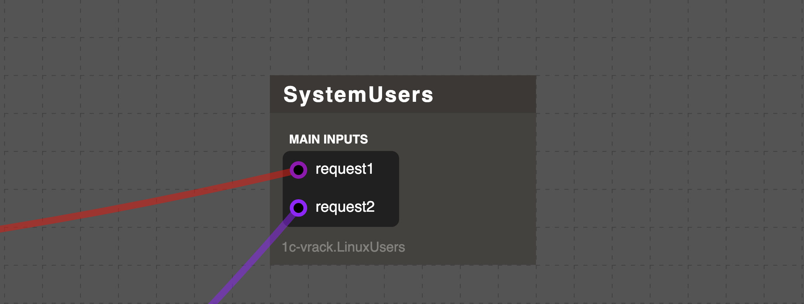

## Особенности программирования в VRack2

Если вы начинаете работать с VRack2, стоит учитывать несколько ключевых принципов проектирования устройств. Они помогут избежать распространённых ошибок и построить масштабируемую, поддерживаемую систему.

### Общие рекомендации по написанию устройств

Сформулируем три основных правила:

1. **Одно устройство - одна зона ответственности.**  
2. **Баланс между сложностью и количеством устройств.**  
3. **Общая логика - в отдельное устройство.**

Рассмотрим каждое подробнее.

### 1. Одно устройство - одна зона ответственности

Название устройства должно чётко отражать его назначение. По имени должно быть понятно, **что оно делает**.

Хорошие примеры:  
`Interval`, `ObjectFileAdapter`, `RAWGamesApi`, `SNMPTrap`, `ParkingManager`, `CashManager`, `AdDisplay`, `BookArchiver`, `Updater`.

Используйте суффиксы вроде `Manager`, `Adapter`, `Transmitter`, `Receiver`, чтобы уточнить роль.

> Может ли `DBUpdater` архивировать базы данных? Да - если это часть его логики обновления.   
> Может ли `ObjectFileAdapter` архивировать базы? Скорее всего, нет - это выходит за рамки его ответственности.

Если вы только начинаете - не зацикливайтесь на идеальной границе ответственности. Пишите, тестируйте. Со временем вы научитесь разделять код интуитивно.

### 2. Баланс между сложностью и количеством устройств

Не стремитесь разбивать всё на мелкие устройства «ради модульности». Это часто приводит к избыточной сложности и трудностям в отладке.

**Пример из практики**:  
Понадобилось инвертировать сигналы DI-модуля. Вместо создания отдельного устройства-инвертера, достаточно было добавить опцию в само устройство:

```json
{
  "id": "DeviceDI1",
  "type": "my-vendor.DeviceDI",
  "options": {
    "invertInputs": {
      "4": true,
      "6": true
    }
  }
}
```

Это решение:
- расширило функциональность без новых компонентов,
- сохранило логику в одном месте,
- упростило конфигурацию.

> **Правило**: сначала попробуйте расширить существующее устройство. Создавайте новое - только если других вариантов нет.

Если же вы всё же вынуждены использовать множество однотипных мелких устройств - используйте генерацию сервис-файла. Это упростит управление и снизит риск ошибок.

### 3. Общая логика - в отдельное устройство

Если один и тот же функционал используется в нескольких устройствах, его нужно вынести.

Есть два подхода:

#### Вариант A: Статический хелпер (для простых, stateless функций)
Подходит, если:
- логика не хранит состояние,
- используется только внутри одного вендора,
- не требует расширения во время работы.

Структура проекта:
```
devices/
└── my-vendor/
    ├── helpers/
    │   └── SystemUtils.js
    ├── MyDevice.js
    ├── SecondDevice.js
    └── list.json
```

#### Вариант B: Отдельное устройство (для сложной или расширяемой логики)
Используйте, если:
- функционал нужен разным вендорам,
- требуется динамическое поведение,
- возможны будущие расширения.

**Пример**: получение информации о системных пользователях.  
Сначала методы были встроены в одно устройство. Когда потребность возникла у другого - логично вынести в отдельное устройство `SystemUsers`.

Как его организовать?  
Не создавайте отдельный вход для каждой операции. Лучше реализовать API-порт с командами:



В коде мы назначаем единый обработчик для всех `requestN` портов:

```js
/**
 * Поддерживаемые команды
 */
commands = [
  'groupsById',
  'groupsByName',
  'groupExist',
  'groupInfo',
  'usersInfo',
  'userInfo',
  'userInGroup'
]

/**
 * Общий обработчик запросов
 */
async request(data) {
  if (!this.commands.includes(data.command)) {
    throw new Error(
      `Неизвестная команда. Доступные: ${this.commands.join(', ')}`
    );
  }
  return this[data.command](data.data);
}
```

Теперь достаточно реализовать методы из списка - и API готов.

**Преимущества такого подхода**:
- Прозрачное расширение: добавили команду - и все потребители получили новый функционал.
- Лёгкая замена: можно подменить `SystemUsers` на сетевую версию без изменения клиентов.
- Возможность проброса во внешний API.

Не бойтесь использовать API-подобное взаимодействие между устройствами. Это мощный инструмент для гибкой архитектуры.

### Заключение

При разработке устройств сервиса помните:

- Чем чётче вы определяете границы ответственности устройства, тем проще будет его поддерживать.
- Не стоит увлекаться модульностью раде модульности
- Не бойтесь делать удобные абстракции

Начните с простого. Постройте рабочий прототип. Затем рефакторьте: выносите общую логику, добавляйте изоляцию, внедряйте сетевые интерфейсы.