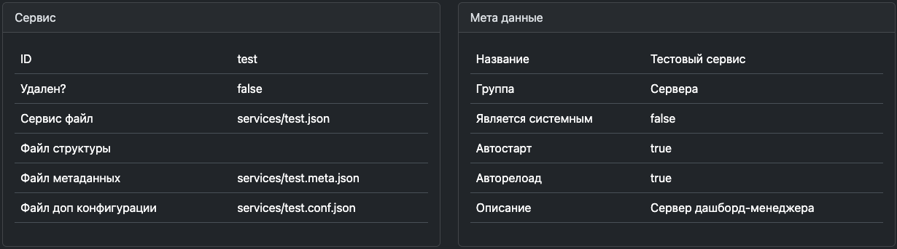

- [Сервис-файл](#сервис-файл)
  - [Создание сервис-файла](#создание-сервис-файла)
  - [Добавление устройства](#добавление-устройства)
  - [Добавление связи](#добавление-связи)
  - [Генерация сервис-файла](#генерация-сервис-файла)
  - [Метаданные сервиса](#метаданные-сервиса)
  - [Переопределение конфигурации сервис-файла](#переопределение-конфигурации-сервис-файла)
  - [Настройки ServiceManager](#настройки-servicemanager)


# Сервис-файл

Сервис-файл содержит список всех используемых устройств, их настройки и соединения между ними.

## Создание сервис-файла

По умолчанию все сервис-файлы лежат в директории `/services`. Для добавления сервиса - необходимо создать файл с названием `service-id.json` где `service-id` название вашего сервиса.

Правила именования:

  - Только строчные латинские буквы
  - Допустимый разделитель: дефис (`-`)
  - Запрещены точки и специальные символы (кроме точки перед расширением)

Базовая структура файла:

```json
{
    "devices": [],
    "connections": []
}
```
 
 - **devices** - Массив с настройками устройств
 - **connections** - Массив соединений
  
## Добавление устройства

Для добавления устройства необходимо добавить в массив `devices` - объект с настройками устройства.

```json
{
    "devices": [
        {
            "id": "Interval",
            "type": "basic.Interval",
            "options": {
                "start": true,
                "timeout": 1200
            }
        }
    ],
    "connections": []
}
```

В котором обязательно должно присутствовать 2 параметра:

 - **id** *string*  - Идентификатор устройства уникальный для данного Сервиса. 
   - Рекомендуемый идентифиактор должен начинатся с большой буквы, разделение в стиле CamelCase.
   - Иногда допускатеся разделение через `:`,`-`
   - Старайтесь не делать длинных идентификаторов - ведь они используются в соединениях
 - **type** *string* - Класс устройства, его можно определить как vendor-name.DeviceClass
 - **options** *Object* - Дополнительные параметры устройства, структура которых определена самим устройством (допускается {} (пустой объект) если не требуются)


Пример с двумя устройствами:

```json
{
    "devices": [
        {
            "id": "Interval1",
            "type": "basic.Interval",
            "options": {
                "start": true,
                "timeout": 1200
            }
        },
        {
            "id": "Debug",
            "type": "basic.Debug",
            "options": {}
        }
    ],
    "connections": []
}
```

## Добавление связи

Для добавления связи необходимо добавить в массив connections строку формата:

```
SourceDeviceID.output.port -> TargetDeviceID.input.port
```

Где слева всегда исходящий порт, а справа - входящий. Допускаются только исходящие связи ->, нельзя использовать <-, <->  и тп.

Пример добавления в общий список:

```json
{
    "devices": [
        {
            "id": "Interval1",
            "type": "basic.Interval",
            "options": {
                "start": true,
                "timeout": 1200
            }
        },
        {
            "id": "Debug",
            "type": "basic.Debug",
            "options": {}
        }
    ],
    "connections": ["Interval1.gate -> Debug.debug1"]
}
```

Но лучшим решением будет добавить соединение прямо в исходящее устройство:

```json
{
    "devices": [
        {
            "id": "Interval1",
            "type": "basic.Interval",
            "options": {
                "start": true,
                "timeout": 1200
            },
            "connections": ["Interval1.gate -> Debug.debug1"]
        },
        {
            "id": "Debug",
            "type": "basic.Debug",
            "options": {}
        }
    ],
    "connections": []
}
```

## Генерация сервис-файла

Минусы JSON формата для сервис-файла:

 - Отсутсвие комментариев
 - Нет возможности использовать переменные
 - Нет возможности брать данные из разных источников

Генерация выгоднее, чем написание JSON в ручную.

Для генерации JSON создайте файл в директории сервисов с раширением `js` и именем сервиса - прим `/services/my-service.js`. 

Минимальный пример файла:

```js
const a = {
    devices: [
        // список устройств
    ],
    connections: [
        // список соединений
    ]
}
    
module.exports = a
```

Далее можно заполнять объект устройствами и соединениями но используя JS код.

**Важные замечания**:
- Файл перегенерируется при каждом сохранении! (при переносе или создании обновляться генерация не будет)
- Для работы требуется:
  - Запущенный VRack2
  - Корректный JavaScript-код
  - Активированная генерация для директории - см [Настройки ServiceManager](#настройки-servicemanager)

## Метаданные сервиса

Для определения дополнительных настроек, необходимо создать рядом с сервис-файлом файл с именем `my-service.meta.json`.

Файл должен содержать метаданные в корректном JSON формате:
```json
{
    "name" : "Читаемое название",
    "group" : "Группа",
    "description" : "Небольшое описание сервиса",
    "autoStart": false,
    "autoReload": false,
    "isolated": false
}
```

Где:

 * **name** *string* - Отображаемое имя сервиса
 * **group** *string* - Группа, в которую входит сервис (Одно слова типа Web,Proxy,Parking)
 * **description** *string* - Небольшое понятное описание сервиса
 * **autoStart** *boolean* - Если `true` сервис будет запущен после старта VRack
 * **autoReload** *boolean* - Если `true` сервис будет перезапущен, если он завершит свою работу в связи с ошибкой
 * **isolated** *boolean* - Если `true` сервис будет запщуен в отдельном процессе для изоляции кода, см [Работа с LL интерфейсами: I²C, Serial...](./LLHardware.md)

## Переопределение конфигурации сервис-файла

Иногда есть необходимость оставлять оригинальный сервис-файл но при этом изменить часть его настроек. Для этого  необходимо создать рядом файл с именем `my-service.conf.json`. Этот файл должен содержать структуру как у обычного файла сервиса, но с устройствами, для которых требует изменение настроек. 

Например есть файл сервиса `my-service.conf.json`:

```json
{
    "devices": [
        {
            "id": "Interval1",
            "type": "basic.Interval",
            "options": {
                "start": true,
                "timeout": 1200
            },
            "connections": ["Interval1.gate -> Debug.debug1"]
        },
        {
            "id": "Debug",
            "type": "basic.Debug",
            "options": {}
        }
    ],
    "connections": []
}
```

У нас есть необходимость переопределить настройки `Interval1`. Создадим  файл с именем `my-service.conf.json` и содержимым:

```json
{
    "devices": [
        {
            "id": "Interval1",
            "type": "basic.Interval",
            "options": {
                "start": true,
                "timeout": 4000
            }
        }
}
```

Это бывает полезно, когда у нас есть готовый сервис в репозитории устройств. Вместо того что бы править оригинальный файл сервиса, лучше создать отдельный файл реконфигурации который добавляется в `.gitignore`. 

Вы всегда можете посмотреть все пути до файлов в VRack2 Manager - прим: 




## Настройки ServiceManager

По умолчанию **vrack2.ServiceManager** настроен на использование директории `/services` в которой включена автоматическая генерация.

Для изменения настроек **ServiceManager** можно воспользоваться  переопределеним конфигурации сервис-файла, только для самого VRack2.

Пример изменения настроек (файл `/devices/vrack2/vrack2.conf.json`):

```json
{
    "devices": [
        {
            "id": "ServiceManager",
            "type": "vrack2.ServiceManager",
            "options": { 
                "autoStart": true,
                "autoReload": true,
                "printErrors": true,
                "servicesDirs": [
                    { "dir": "./services", "generate": true },
                    { "dir": "./devices/you-vendor/you-service-dir", "generate": false }
                ]
            }
        }
    ]
}
```

После чего потребуеться перезапуск самого VRack2. Таким образом можно расширять функционал самого VRack2 и вносить изменения в его настройки.